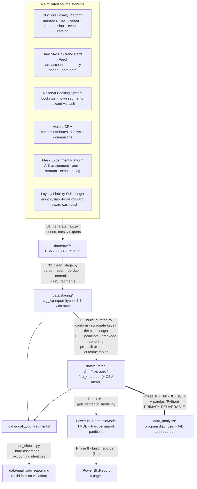

# AeroVanti SkyPoints — Data Architecture

**Document status:** Phase 2 deliverable.
**Depends on:** `01_business_context_kpis.md`.
**Feeds:** Phase 3 (ETL build), Phase 4 (data dictionary / model docs), Phase 6 (semantic model), **Phase 10 (analysis — primary deliverable)**.

This is a build spec: every layer, every table, every data-quality issue Phase 3 must inject
and then handle. Scope note from Phase 0: the messy-data layer is **reduced** — 6 simulated
source systems, 6 primary data-quality issue classes. Effort is concentrated on a curated
layer that serves the A/B test read-out cleanly.

---

## 1. Principles — medallion, seeded, idempotent

Data only ever flows downward.

| Layer | Folder | Contract |
|---|---|---|
| **Raw** | `data/raw/<source>/` | Byte-faithful simulated exports — messy, locale-specific, duplicated, encoded however the fake source system would encode it. **Never edited after generation.** Regenerated only when `SEED` / `config.py` changes. |
| **Staging** | `data/staging/` | Exactly one typed table per raw entity: `stg_<source>_<entity>.parquet`. Parsing, type coercion, encoding repair, de-duplication, key & category normalisation. **No cross-source joins, no business logic, no metric definitions.** Every fix counted into a DQ fragment. |
| **Curated** | `data/curated/` | Conformed Kimball star: `dim_*` / `fact_*` as Parquet **and** a CSV mirror. Surrogate keys, tier-status-from-ledger, FIFO point-lot accounting, breakage cohorting, the pre-built experiment outcome tables, `is_steady_state_cohort`. All money in **BRL** (no FX). |
| **Quality** | `data/quality/` | DQ fragments from staging + curated, assembled into `dq_report.md`; hard-assertion results from `dq_checks.py`. |

**Seeded.** A single `SEED` in `etl/config.py` drives every random draw. Same seed →
byte-identical raw → identical curated. **The true Flash Redemption effect lives only in
`config.py`** (see §10).

**Idempotent.** Each script wipes and rebuilds its own layer. `run_pipeline.py` runs
`01 → 02 → 03 → dq_checks` end to end; `dq_checks.py` exits non-zero on any violated assertion.

**Layered.** Staging reads only raw. Curated reads only staging. The semantic model (Phase 6)
and the analysis (Phase 10) read only `data/curated/*.parquet`.

---

## 2. Tech stack & run instructions

| Concern | Choice |
|---|---|
| Language | Python 3.11+ |
| Core libs | `pandas`, `numpy`, `pyarrow` (Parquet), `python-dateutil`, `openpyxl` (write messy `.xlsx`), `Faker` (`pt_BR` locale — names, cities, CPF-like ids), `ftfy` + `unicodedata` (encoding repair in staging), `duckdb` (Phase 10 SQL track + optional staging SQL), `scipy` / `statsmodels` (Phase 10 tests — not used in ETL) |
| Storage | Flat files. Raw = `.csv` / `.xlsx` / `.csv.gz` / `.parquet`. Staging & curated = `.parquet` (+ curated `.csv` mirror). No database server. |
| Orchestration | Plain scripts, ordered by `run_pipeline.py`. No Airflow / dbt. |
| Determinism | One `SEED`; every generator derives a named sub-seed from it. |
| Windows / OneDrive | Write to a temp path in the same folder, then atomic `os.replace`; a retry-on-lock wrapper (`utils.write_parquet`, ~4 attempts, backoff) absorbs intermittent WinError 5/32 locks. |

```
# from repo root
python -m pip install -r etl/requirements.txt
python etl/run_pipeline.py            # full build: raw -> staging -> curated -> dq_checks
python etl/run_pipeline.py --from 02  # rebuild staging + curated only
python etl/gen_data_dictionary.py     # regenerate docs/03_data_dictionary.md from disk
```

Run order inside `run_pipeline.py`:

1. `01_generate_raw.py` — writes `data/raw/**`
2. `02_clean_stage.py` — writes `data/staging/stg_*.parquet` + `data/quality/dq_fragments/stg_*.json`
3. `03_build_curated.py` — writes `data/curated/{dim,fact}_*.{parquet,csv}` + curated DQ fragments
4. `dq_checks.py` — hard assertions; assembles `data/quality/dq_report.md`; non-zero exit on failure

---

## 3. Naming conventions

| Thing | Rule | Example |
|---|---|---|
| Raw file | `<source>__<entity>__<period-or-grain>.<ext>` | `skycore__point_transactions__2025-07.csv` |
| Staging table | `stg_<source>_<entity>` | `stg_skycore_point_transactions` |
| Dimension | `dim_<noun>` | `dim_member` |
| Fact | `fact_<process>_<grain>` | `fact_point_transaction` |
| Surrogate key | `<entity>_key` — integer, curated only | `member_key` |
| Business key | `<entity>_id` — preserved from source | `member_id` |
| Date | `<role>_date` (date) · `<role>_date_key` (int `YYYYMMDD`) | `enrollment_date`, `enrollment_date_key` |
| Timestamp | `<role>_ts` — tz-aware, **America/Sao_Paulo** in curated | `assigned_ts` |
| Money | `<measure>_brl` (single currency) | `flight_revenue_brl`, `liability_brl` |
| Points | `<measure>_pts` or `points_<x>` | `points_earned_m`, `balance_pts` |
| Boolean | `is_<x>` / `has_<x>` | `is_lapsed_eom`, `has_cobrand_card` |
| Columns | `snake_case` throughout curated | |

Source timestamps are parsed to tz-aware UTC in staging, then curated derives the
**Brazil-local calendar day** (`America/Sao_Paulo`) and every `*_date_key` from that local
day, so month-boundary and experiment-week-boundary events land in the right bucket.

---

## 4. Source-system inventory

Six simulated systems. "Export style" is what makes each one messy.

| # | System (fictional) | Owns | Raw entities | Export style / quirks |
|---|---|---|---|---|
| 1 | **SkyCore Loyalty Platform** | Program of record: members, point ledger, tier snapshot **and** tier-change events, reward catalog | `members_snapshot` (daily full dump), `point_transactions` (monthly), `tier_snapshots_monthly`, `tier_change_events`, `reward_catalog` | Daily full-dump member snapshot → **massive row duplication**; `point_transactions` split into monthly files with **overlapping date ranges** → cross-file dupes; `points` and any BRL value occasionally exported as text; `member_since` mixes `YYYY-MM-DD` and `DD/MM/YYYY`; **`tier_snapshots_monthly` drifts from `tier_change_events`** (snapshot job runs on stale replica). |
| 2 | **BancoAV Co-Brand Card Feed** | Co-branded Mastercard: card accounts, monthly spend, SkyPoints issued from spend | `card_accounts`, `card_spend_monthly` | Bank export in **Latin-1** → mojibake on holder names / city; `valor_fatura` as `"R$ 1.234,56"`; `competencia` (statement month) as **Excel serial**; the **June 2025 file was delivered twice** with a different filename → duplicate month. |
| 3 | **Reserva Booking System** | Flights: bookings, flown segments, base fare, fare family, award vs cash | `bookings`, `segments` | Third-party PSS export with **`MM/DD/YYYY`** dates; taxes sometimes inside `fare_total`, sometimes separate; `loyalty_member_id` **blank for non-member bookings** and, for ~2% of member bookings, points to a `member_id` **absent from SkyCore** (guest→member merge lag); duplicate segment rows on schedule changes. |
| 4 | **Aurora CRM** | Member contact attributes, lifecycle stage, campaign membership, contact consent | `crm_contacts`, `campaign_membership` | Free-text `lifecycle_stage`; `data_nascimento` sometimes `1900-01-01` or `0`; **CRM went live in program month 4**, so members enrolled in months 1–3 have **no CRM row**; `cidade` with encoding damage; overlapping campaign memberships. |
| 5 | **Flesk Experiment Platform** | A/B assignment for Flash Redemption: arm, stratum, enrolment, feature-flag exposure | `ab_assignments`, `exposure_log` | Modern tool, mostly clean — but `exposure_log` is **at-least-once** (duplicate rows); all timestamps **UTC with `Z`** while every other system is Brazil-local; ~30 `ab_assignments` rows are **late eligibility corrections** for members who did not meet the frozen 2026-03-01 criteria and must be reconciled out. |
| 6 | **Loyalty Liability Sub-Ledger (Finance)** | Monthly points issued/redeemed/expired totals, liability balance, breakage provision, cash cost of partner rewards | `liability_rollforward_monthly`, `reward_cost_monthly` | `.xlsx`, one row per month; free-text account labels; amounts as text with **parentheses negatives** `"(1.234,00)"`; `mes` column as **Excel serial**; **months 2025-11 and 2026-02 were restated** (two versions in the file, later one wins). |

`tier_change_events` (SkyCore) is the **movement source of truth**; `tier_snapshots_monthly`
is kept only to *measure* drift (DQ issue Q06). Flesk (#5) corresponds to the experiment
itself — a designed intervention, not "neutral history".

---

## 5. Raw layer — what `01_generate_raw.py` emits

Volumes are approximate at `SEED` default.

| Raw file(s) | Grain | ~Rows | Key messy traits injected |
|---|---|---|---|
| `skycore__members_snapshot__YYYY-MM-DD.csv` (daily) | member × snapshot day | ~40M (dupe-heavy) | full re-dump daily; `member_since` mixed date formats; `home_city` casing noise |
| `skycore__point_transactions__YYYY-MM.csv` | one ledger entry | ~3.3M | overlapping monthly ranges → cross-file dupes; `points` / `value_brl` sometimes text; `txn_type` free text (`earn`/`Earn`/`ACCRUAL`, `redeem`/`redemption`, `expire`/`expiry`) |
| `skycore__tier_snapshots_monthly.csv` | member × month | ~2.4M | drifts from the event ledger (~3–6% of member-months disagree) |
| `skycore__tier_change_events.csv` | tier-change event | ~250k | the movement truth; a few duplicate `event_id` (at-least-once) |
| `skycore__reward_catalog.xlsx` | reward option × effective period | ~40 | Excel-serial `available_from`; `points_price` as text; the Flash low-cost rows have `available_from = 2026-03-02` |
| `bancoav__card_accounts.csv` | card account | ~34k | Latin-1 names/city; `abertura` date as `DD/MM/YYYY`; some accounts with no matching SkyCore member (pre-enrolment applications) |
| `bancoav__card_spend_monthly.csv` | card account × month | ~700k | `valor_fatura` as `"R$ 1.234,56"`; `competencia` Excel serial; **June 2025 duplicated** |
| `reserva__bookings.csv` | booking (PNR) | ~1.4M | `MM/DD/YYYY` dates; `channel` free text |
| `reserva__segments.csv` | flown segment | ~1.9M | taxes bundled/unbundled inconsistently; blank / orphan `loyalty_member_id`; duplicate rows on schedule change |
| `aurora__crm_contacts.csv` | member | ~135k | free-text lifecycle stage; `data_nascimento` 1900/0; missing months-1–3 cohorts; `cidade` mojibake |
| `aurora__campaign_membership.csv` | member × campaign | ~180k | campaign-name noise; overlapping memberships |
| `flesk__ab_assignments.csv` | assigned member | ~15,030 | ~30 ineligible late-correction rows to reconcile out; `stratum` present |
| `flesk__exposure_log.csv` | member × exposure event | ~120k | at-least-once duplicates; UTC `Z` timestamps |
| `ledger__liability_rollforward_monthly.xlsx` | month | ~26 | parentheses negatives; Excel-serial month; 2 restated months (dupe rows) |
| `ledger__reward_cost_monthly.xlsx` | month × reward category | ~150 | text amounts; free-text category labels |

---

## 6. Staging layer — `02_clean_stage.py`

One `stg_*` table per raw entity. Responsibilities and the DQ counter each raises:

| Fix class | What happens | DQ counter(s) |
|---|---|---|
| **Date parsing** | Parse `YYYY-MM-DD`, `DD/MM/YYYY`, `MM/DD/YYYY`, ISO-8601 with TZ, and **Excel serials** (epoch 1899-12-30). Ambiguous `01/02/2025` resolved by source-locale rule (Reserva = US, everything else = BR). | `dates_parsed`, `excel_serials_converted`, `dates_unparseable` |
| **Money parsing** | Strip `R$`, thousands `.` and decimal `,`; `"(x)"` → `-x`; blank → null (never 0). | `money_strings_parsed`, `money_negatives_from_parens` |
| **Points parsing** | Coerce `points` to int; sign by `txn_type` (earn +, redeem/expire −); text magnitudes (`"1.500"`) parsed. | `points_strings_parsed`, `points_sign_normalised` |
| **Encoding repair** | `ftfy.fix_text` + targeted Latin-1→UTF-8 re-decode for BancoAV / Aurora; strip BOM. | `mojibake_repaired`, `bom_stripped` |
| **De-duplication** | Drop exact-duplicate `event_id` / `txn_id` / exposure rows; collapse daily member full-dump to one row per member per day; dedupe overlapping `point_transactions` monthly files on `txn_id`; drop the re-delivered BancoAV June-2025 file; keep only the latest restatement of a ledger month. | `dupe_events_dropped`, `snapshot_rows_collapsed`, `dupe_txn_dropped`, `restated_months_resolved` |
| **Timezone** | All timestamps → tz-aware UTC (Flesk already `Z`; others localised from `America/Sao_Paulo`). | `timestamps_localized` |
| **Category harmonisation** | Map `txn_type`, `lifecycle_stage`, booking `channel`, tier labels, reward categories to controlled vocab in `etl/vocab/`. Unknowns → explicit `"unknown"` + logged. | `categories_normalised`, `category_unknowns` |
| **Key normalisation** | Trim business keys; cast to string; null-out placeholders (`"0"`, `""`, `"N/A"`). Blank `loyalty_member_id` on bookings → explicit null (non-member). | `null_keys_flagged` |
| **Birth-year sanity** | `data_nascimento` ∈ {1900-01-01, 0, future} → null + `birth_year_valid = false`. | `birthyear_invalidated` |
| **Type coercion** | Enforce a declared dtype per column; failures → null + counter. | `type_coercion_failures` |

Staging does **not** join across sources, does **not** compute balances / lapse / breakage,
and does **not** drop rows for referential problems — that is curated's job, fully accounted.

---

## 7. Curated layer — `03_build_curated.py`

Kimball star. `dim_date` is built first and spans **2024-01-01 → 2027-12-31** (well past the
fact window, per the guardrail about a stray "(blank)" date member when point lots expire and
tiers re-evaluate past window end).

### 7.1 Dimensions

| Table | Grain | Notable attributes |
|---|---|---|
| `dim_date` | calendar day | `date_key`, y/q/m/iso-week, `month_name`, `is_month_end`, `is_holiday_br`, `season_tag`, **`experiment_phase`** (pre / test / post), **`experiment_week`** (1–12 during 2026-03-02→2026-05-24, else null), hidden sort keys |
| `dim_member` | member | `member_key`, `member_id`, `enrollment_date_key`, `enrollment_cohort_month`, `enrollment_channel` (flight / card / web / partner), `home_city`, `home_region` (BR macro-region), `has_cobrand_card` (ever), `current_tier_key`, `age_band`, `birth_year_valid`, `crm_lifecycle_stage`, **`is_steady_state_cohort`** (enrolled ≤ 2024-12), `is_test_account`, **`experiment_arm`** (control / treatment / not_enrolled), **`experiment_stratum`** (tier at assignment, else n/a), `is_experiment_subject` |
| `dim_tier` | tier | `tier_key`, `tier_name` (Blue/Silver/Gold/Platinum), `tier_rank` (1–4), `earn_multiplier`, `tp_threshold`, `segment_threshold`, `is_elite` (Silver+) |
| `dim_earn_source` | earn source | `earn_source_key`, `source_name` (flight / cobrand_card / partner_hotel / partner_car / partner_retail / promo / service_recovery), `source_group` (flight / card / partner / other), `earns_tier_points` |
| `dim_reward_type` | redemption option | `reward_type_key`, `reward_name`, `reward_category` (award_flight / seat / bag / lounge / gift_card / voucher), `points_price_typical`, `value_per_point_brl`, **`is_low_cost_catalog`** (the Flash additions), `available_from_date_key` |
| `dim_route` | route | `route_key`, `origin`, `dest`, `haul_band` (short / medium), `region_pair` — slim; flights are not a deep thread |
| `dim_experiment_arm` *(disconnected slicer helper, built Phase 6)* | arm | `control` / `treatment` / `not_enrolled` |
| `dim_experiment_stratum` *(disconnected slicer helper)* | stratum | Blue / Silver / Gold / Platinum |

### 7.2 Facts

| Table | Grain | Measures / columns | Build notes |
|---|---|---|---|
| `fact_point_transaction` | one ledger entry | `member_key`, `txn_date_key`, `txn_type` (earn / redeem / expire / adjust), `earn_source_key`, `reward_type_key`, `points` (signed), `points_value_brl`, `earn_month_key` (issuing lot), `lot_id`, `booking_id`, `is_experiment_window` | Deduped, ordered. **FIFO** lot linkage: each redeem/expire row consumes named lots; `earn_month_key` carries the issuing cohort for breakage attribution. Spine of earn/burn/breakage. |
| `fact_member_month` | member × month | `is_active_eom`, `is_lapsed_eom`, `became_lapsed_this_month`, `is_reactivation`, `months_since_last_activity`, `tier_key` (ledger-derived), `balance_pts_eom`, `points_earned_m`, `points_redeemed_m`, `points_expired_m`, `redemptions_m`, `has_redeemed_ever_eom`, `flights_m`, `flight_revenue_brl_m`, `card_spend_brl_m`, `tenure_months`, `is_new_enrollment` | **The retention / program-health workhorse.** Lapse = 12 consecutive months with no earn and no redemption; for the first 11 months from window start `is_lapsed_eom` is **null** (undeterminable) — not `false`. Once lapsed, stays lapsed until a reactivation row. |
| `fact_flight_segment` | one flown segment | `member_key` (sentinel −1 non-member / −2 orphan), `flight_date_key`, `booking_date_key`, `route_key`, `fare_family`, `base_fare_brl`, `taxes_brl`, `booking_channel`, `is_award_redemption`, `points_redeemed`, `skypoints_earned`, `tier_points_earned` | Taxes reconciled to a single definition; duplicate schedule-change rows collapsed. Supports award-seat share, revenue per member, flight earn. |
| `fact_card_spend_month` | member × month | `card_spend_brl`, `skypoints_earned`, `is_card_active` | From BancoAV; joined to member on card→member map. |
| `fact_tier_change` | one tier-change event | `member_key`, `change_date_key`, `from_tier_key`, `to_tier_key`, `direction` (upgrade / downgrade / retain_drop), `trigger` (qualification / soft_landing / manual) | Ledger-derived, deduped. **Curated tier status is folded forward from this**, never from the snapshot. |
| `fact_liability_month` | month | `points_outstanding_eop`, `liability_brl_gross`, `liability_brl_breakage_adj`, `points_issued_m`, `points_redeemed_m`, `points_expired_m`, `breakage_provision_brl`, `reward_cash_cost_brl` | From the sub-ledger, **reconciled to `fact_point_transaction` roll-up within 0.5%** (DQ check). Unit cost per doc 01 §5.3. |
| `fact_experiment_assignment` | one assigned member (~15,000) | `member_key`, `arm_key`, `stratum`, `assigned_ts`, `pre_earn_12m_pts`, `pre_flights_12m`, `pre_redemptions_12m`, `pre_balance_pts`, `prior_redeemer_flag`, `pre_tenure_months` | Ineligible late-correction rows reconciled out. **Pre-period covariates frozen at 2026-03-01** — used for the SRM / balance checks and CUPED-style variance reduction in Phase 10. |
| `fact_experiment_member_week` | assigned member × experiment week (~180,000) | `arm_key`, `redeemed_w`, `redemptions_w`, `points_redeemed_w`, `redemption_value_brl_w`, `low_cost_only_w`, `earn_w`, `flights_w`, `flight_revenue_brl_w` | The **weekly series** for the novelty-effect diagnostic. |
| `fact_experiment_outcome` | one assigned member (~15,000) | `redeemed_in_window` (**primary**), `redemptions_in_window`, `redemption_value_brl`, `low_cost_only`, `revenue_brl_window_plus8w`, `liability_drawdown_brl`, `reward_cash_cost_brl`, `net_liability_cost_brl`, `disengaged_90d_post`, `earn_in_window`, `flights_in_window`, `active_post_quarter` | One tidy row per subject with **every metric the read-out needs**, pre-computed so Phase 10 goes straight to tests and the report needs almost no DAX. `redeemed_in_window` == OR of the weekly flags (DQ check). |
| `fact_targets_month` | month × kpi | `target_value` | Plan from doc 01 §12; same basis as actuals. |

### 7.3 Cross-cutting curated rules

- **Tier status from ledger.** `fact_member_month.tier_key` and `dim_member.current_tier_key`
  are folded forward from `fact_tier_change`. `tier_snapshots_monthly` is used **only** to
  compute a drift metric (member-months where snapshot ≠ ledger-derived), reported in the DQ
  report, never as input.
- **FIFO point-lot accounting.** Every redeem / expire consumes the oldest open lots;
  `earn_month_key` on each consuming row ties breakage and redemption back to the **issuance
  cohort**, so cohort-based breakage (doc 01 §5.3) is computable.
- **Breakage-adjusted liability.** `liability_brl_breakage_adj` = points outstanding ×
  R$0.021 × (1 − expected breakage), with `expected_breakage` a `config.py` parameter; the
  gross figure is also kept. A sensitivity table over the breakage assumption is a Phase-10
  artifact, not baked here.
- **Lapse honesty.** `is_lapsed_eom` is null for the first 11 months and for any member with
  < 12 months tenure — the 12-month rule is simply not yet evaluable. Never coerced to false.
- **Sentinel keys.** `member_key = -1` (non-member booking), `-2` (orphan — member id not in
  master). Facts are **never dropped** for a missing dimension; the sentinel is used and
  counted.
- **Experiment denormalisation.** `experiment_arm` / `experiment_stratum` /
  `is_experiment_subject` are stamped on `dim_member` and propagated to `fact_member_month`
  via `member_key`, so the report can slice program health by arm without touching the
  experiment facts.
- **Local calendar day** (`America/Sao_Paulo`) drives every `*_date_key`, including the
  experiment-week bucketing.
- **BRL only.** Every money column is `*_brl`. No `_usd` sibling, no FX table.

---

## 8. Data-quality issue catalogue (the injection list)

Six **primary** classes — injected by `01`, handled by `02`/`03`, counted into a DQ
fragment, and (where an invariant) asserted in `dq_checks.py`.

| # | Issue | Injected in | Handled in | Hard check |
|---|---|---|---|---|
| Q01 | **Multiple date formats + Excel serials** | skycore `member_since`, bancoav, reserva (`MM/DD/YYYY`), ledger, reward_catalog | staging date parser (locale rule per source) | `dates_unparseable = 0` |
| Q02 | **Money as locale strings / parentheses negatives / symbol-in-value** | bancoav `card_spend_monthly`, ledger `.xlsx`, some skycore `value_brl` | staging money parser | no non-null money column is object dtype; `liability_brl_gross ≥ 0` |
| Q03 | **Encoding damage (Latin-1 mojibake, BOM)** | bancoav names/city, aurora `cidade` | `ftfy` + targeted re-decode | no `Ã`/`Â` mojibake sequences remain in `dim_member.home_city` |
| Q04 | **Duplicate rows** — daily full-dump snapshot, overlapping monthly `point_transactions`, re-delivered BancoAV month, at-least-once event/exposure rows | skycore, bancoav, flesk | staging de-dup (collapse / dedupe on id / drop re-delivered file) | `fact_point_transaction` unique on `txn_id`; `fact_flight_segment` unique on `segment_id`; snapshot collapsed to 1 row / member / day |
| Q05 | **Missing master rows / orphan keys** — bookings referencing members absent from SkyCore, point rows for unknown members, months-1–3 cohorts with no CRM row | reserva, skycore, aurora late go-live | curated sentinel keys + count; CRM attributes left null with a `crm_present` flag | every fact FK resolves to a real or sentinel key; orphan count reported |
| Q06 | **Snapshot-vs-ledger drift** — `tier_snapshots_monthly` disagrees with `tier_change_events` | skycore | curated builds status from the event ledger; drift measured | curated tier status == ledger-derived **by construction**; drift-row count reported (expected 3–6% of member-months) |

**Also handled, without ceremony** (minor, single counter each, no dedicated narrative):
null/placeholder keys → sentinels; invalid birth years → null + flag; negative or
out-of-range points/values → clamped + counted; Flesk UTC vs Brazil-local timezone bleed →
converted; ledger restated months → latest wins; `txn_type` / channel / lifecycle free-text
→ controlled vocab.

`dq_checks.py` also asserts the **accounting / roll-up identities**:

- **Points roll-forward**, per member per month **and** program-wide per month:
  `opening_balance + earned − redeemed − expired = closing_balance` (exact, integer points).
- **Liability tie-out:** `fact_liability_month` issued / redeemed / expired totals match the
  `fact_point_transaction` roll-up within 0.5%; closing liability = opening + issued −
  redeemed − expired − revaluation.
- **Experiment integrity:** every `fact_experiment_member_week` / `fact_experiment_outcome`
  `member_key` ∈ `fact_experiment_assignment`; `redeemed_in_window` == OR of weekly flags;
  allocation ratio ∈ [0.49, 0.51] within every stratum (a *build-time* sanity check — the
  real SRM test is on observed data in Phase 10); pre-period covariates present for all
  subjects; data extends ≥ 90 days past 2026-05-24.
- **Retention consistency:** a lapsed member stays lapsed until a reactivation row; cohort
  retention curves are monotone non-increasing and ≤ 100%.
- **Benchmark bands:** redemption rate, breakage rate, 12-month lapse rate, burn/earn ratio
  and tier mix all land inside their doc 01 §11 ranges for the **pre-experiment
  steady-state** period (the experiment arms are allowed to diverge — that is the point).

---

## 9. Architecture diagram



---

## 10. Open items carried into Phase 3

| # | Item | Resolution plan |
|---|---|---|
| B1 | **The true Flash Redemption effect** — overall lift, per-tier heterogeneity profile, novelty-decay shape, and the guardrail impacts (revenue/member, liability cost/member, 90-day disengagement) | **Decided in Phase 3**, encoded in `config.py` as tunable effect sizes + noise; kept out of docs 00/01; detected blind in Phase 10. Design intent: a real, non-trivial but not-obvious overall lift; effect concentrated in lower tiers; a modest early novelty bump that decays; guardrails roughly neutral with at least one that needs a careful (non-inferiority / borderline) read. |
| B2 | Final row volumes vs the ~3M point-transaction / ~2.4M member-month targets | Calibrate `SEED`-default population and activity rates in the first regeneration pass. |
| B3 | Benchmark-band calibration (redemption rate, breakage, burn/earn, lapse, tier mix, months-to-first-redemption, award-seat share) | Several regeneration passes until the pre-experiment steady-state sits mid-band for every doc 01 §11 KPI. |
| B4 | BR holiday / school-break calendar & travel seasonality curve | Static lookup in `etl/vocab/br_calendar.csv`; seasonal multipliers in `config.py`. |
| B5 | Co-brand card penetration curve and card-earn share of issuance | Seeded logistic adoption curve; target ~20% active-member penetration, ~42% of issuance, at window end. |
| B6 | Exact eligible-pool size and per-stratum counts | Generator targets ~58k eligible; assignment draws exactly 8,000 / 4,000 / 2,200 / 800, 50/50 within stratum. |

---

*End of Phase 2 deliverable.*
