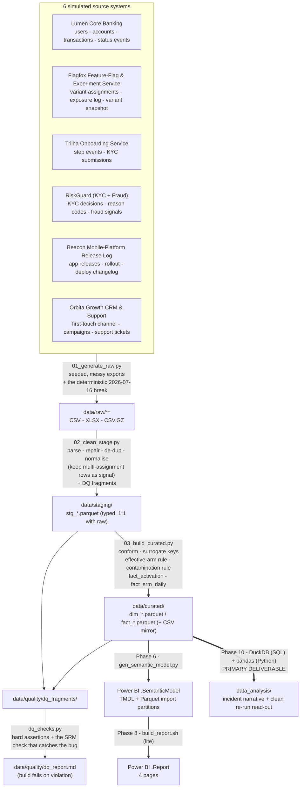

# LumaBank — Data Architecture

**Document status:** Phase 2 deliverable.
**Depends on:** `01_business_context_kpis.md`.
**Feeds:** Phase 3 (ETL build), Phase 4 (data dictionary / model docs), Phase 6 (semantic model), **Phase 10 (analysis — primary deliverable)**.

This is a build spec: every layer, every table, every data-quality issue Phase 3 must
inject and then handle — **plus** the bug-specific catalog (§9) that makes the first
experiment run break on 2026-07-16. Scope note from Phase 0: the messy-data layer is
**balanced** — 6 simulated source systems, 7 generic data-quality classes, and a 3-item
bug catalog. Effort is concentrated on a curated layer that serves the incident narrative
and the clean re-run read-out.

> **PT — resumo.** Pipeline medallion (raw → staging → curated), tudo seedado e
> idempotente. 6 sistemas-fonte simulados. O star schema curated entrega uma linha por
> usuário randomizado (`fact_activation`) já com Day-7 Activation e todos os guardrails
> calculados, mais uma tabela `fact_srm_daily` (uma linha por dia de experimento) que
> alimenta o monitor de integridade. A quebra do dia 16/07 **não é ruído** — é injetada
> de propósito por `01_generate_raw.py` de forma determinística (eventos de cache-reset,
> troca de braço, e fallback de atribuição enviesado por região/timezone), e o
> `dq_checks.py` tem um check que **pegaria o SRM** como falha de qualidade de dados.

---

## 1. Principles — medallion, seeded, idempotent

Data only ever flows downward.

| Layer | Folder | Contract |
|---|---|---|
| **Raw** | `data/raw/<source>/` | Byte-faithful simulated exports — messy, locale-specific, duplicated, encoded however the fake source system would encode it. **Never edited after generation.** Regenerated only when `SEED` / `config.py` changes. |
| **Staging** | `data/staging/` | Exactly one typed table per raw entity: `stg_<source>_<entity>.parquet`. Parsing, type coercion, encoding repair, de-duplication, key & category normalisation. **No cross-source joins, no business logic, no metric definitions.** Every fix counted into a DQ fragment. |
| **Curated** | `data/curated/` | Conformed Kimball star: `dim_*` / `fact_*` as Parquet **and** a CSV mirror. Surrogate keys, effective-arm resolution from the assignment event log, the auditable contamination rule, the pre-built `fact_activation` and `fact_srm_daily` tables. All money in **BRL**. |
| **Quality** | `data/quality/` | DQ fragments from staging + curated, assembled into `dq_report.md`; hard-assertion results from `dq_checks.py`. |

**Seeded.** A single `SEED` in `etl/config.py` drives every random draw. Same seed →
byte-identical raw → identical curated. **The true treatment effect and the production-bug
magnitudes live only in `config.py`** (see §10).

**Idempotent.** Each script wipes and rebuilds its own layer. `run_pipeline.py` runs
`01 → 02 → 03 → dq_checks` end to end; `dq_checks.py` exits non-zero on any violated
assertion.

**Layered.** Staging reads only raw. Curated reads only staging. The semantic model
(Phase 6) and the analysis (Phase 10) read only `data/curated/*.parquet`.

---

## 2. Tech stack & run instructions

| Concern | Choice |
|---|---|
| Language | Python 3.11+ |
| Core libs | `pandas`, `numpy`, `pyarrow` (Parquet), `python-dateutil`, `openpyxl` (write messy `.xlsx`), `Faker` (`pt_BR` — names, cities, CPF-like ids), `ftfy` + `unicodedata` (encoding repair in staging), `duckdb` (Phase 10 SQL track), `scipy` / `statsmodels` (Phase 10 tests — not used in ETL) |
| Storage | Flat files. Raw = `.csv` / `.xlsx` / `.csv.gz`. Staging & curated = `.parquet` (+ curated `.csv` mirror). No database server. |
| Orchestration | Plain scripts, ordered by `run_pipeline.py`. No Airflow / dbt. |
| Determinism | One `SEED`; every generator derives a named sub-seed from it. The 2026-07-16 break is derived from `SEED` + `user_id` hashes + a deterministic app-open model — **reproducible, not random**. |
| Windows / OneDrive | Write to a temp path in the same folder, then atomic `os.replace`; a retry-on-lock wrapper (`utils.write_parquet`, ~4 attempts, backoff) absorbs intermittent WinError 5/32 locks. |

```
# from repo root
python -m pip install -r etl/requirements.txt
python etl/run_pipeline.py            # full build: raw -> staging -> curated -> dq_checks
python etl/run_pipeline.py --from 02  # rebuild staging + curated only
python etl/gen_data_dictionary.py     # regenerate docs/03_data_dictionary.md from disk
```

Run order inside `run_pipeline.py`:

1. `01_generate_raw.py` — writes `data/raw/**`
2. `02_clean_stage.py` — writes `data/staging/stg_*.parquet` + `data/quality/dq_fragments/stg_*.json`
3. `03_build_curated.py` — writes `data/curated/{dim,fact}_*.{parquet,csv}` + curated DQ fragments
4. `dq_checks.py` — hard assertions; assembles `data/quality/dq_report.md`; non-zero exit on failure

---

## 3. Naming conventions

| Thing | Rule | Example |
|---|---|---|
| Raw file | `<source>__<entity>__<period-or-grain>.<ext>` | `lumencore__transactions__2026-07.csv` |
| Staging table | `stg_<source>_<entity>` | `stg_flagfox_variant_assignments` |
| Dimension | `dim_<noun>` | `dim_user` |
| Fact | `fact_<process>_<grain>` | `fact_variant_assignment` |
| Surrogate key | `<entity>_key` — integer, curated only | `user_key` |
| Business key | `<entity>_id` — preserved from source | `user_id` |
| Date | `<role>_date` (date) · `<role>_date_key` (int `YYYYMMDD`) | `signup_date`, `signup_date_key` |
| Timestamp | `<role>_ts` — tz-aware, **user-local** in curated (§7.3) | `assigned_ts`, `first_txn_ts` |
| Money | `<measure>_brl` (single currency) | `txn_amount_brl` |
| Boolean | `is_<x>` / `has_<x>` / `<x>_flag` | `is_rejection`, `day7_activated`, `contaminated_flag` |
| Columns | `snake_case` throughout curated | |

Source timestamps are parsed to tz-aware UTC in staging, then curated derives the user's
**local calendar day** (`America/Sao_Paulo` for all regions except the Amazonas / Acre
timezones — §7.3) and every `*_date_key` from that local day, so day-boundary and
experiment-day-boundary events land in the right bucket. **This matters for the Day-7
window and for the daily SRM counts.**

---

## 4. Source-system inventory

Six simulated systems. "Export style" is what makes each one messy.

| # | System (fictional) | Owns | Raw entities | Export style / quirks |
|---|---|---|---|---|
| 1 | **Lumen Core Banking** | System of record: users, accounts, transactions, account-status events | `users_snapshot` (daily full dump), `accounts`, `transactions` (monthly), `account_status_events` | Daily full-dump user snapshot → **massive row duplication**; `transactions` split into monthly files with **overlapping date ranges** → cross-file dupes; `amount` occasionally exported as `"R$ 1.234,56"`; `opened_at` mixes `YYYY-MM-DD` and `DD/MM/YYYY`; transaction timestamp as **Unix epoch-milliseconds**. |
| 2 | **Flagfox Feature-Flag & Experiment Service** | A/B assignment for the onboarding test: arm, assignment source, cache-reset flag, exposure log, current-variant snapshot | `variant_assignments`, `exposure_log`, `variant_snapshot` (daily) | Modern tool, mostly clean — but `exposure_log` is **at-least-once** (duplicate rows); all timestamps **UTC with `Z`** while every other system is Brazil-local; **from 2026-07-16 an `assignment_source = 'fallback'` value appears**, a subset of rows carry `cache_reset = true`, and some users get a **second `variant_assignments` row** (the contamination); `variant_snapshot` drifts from the event log. |
| 3 | **Trilha Onboarding Service** | The signup funnel: step events, KYC submissions | `onboarding_step_events`, `kyc_submissions` | Step events **at-least-once**; `step_name` free text (`kyc_upload` / `KYC_UPLOAD` / `doc_upload`); `occurred_at` ISO-8601 with offset; ~3% of sessions **missing the terminal step** (client dropped before the ack was written). |
| 4 | **RiskGuard (KYC + Fraud)** | KYC decisions & reason codes, fraud signals | `kyc_decisions`, `kyc_reason_codes` (ref), `fraud_signals` | **Exports in UTC**, no offset column; `decided_at` sometimes **date-only**; reason codes as free text *and* code; fraud `signal_ts` as **epoch-seconds**; ~1–2% of decisions reference a `user_id` **absent from Core** (queue lag). |
| 5 | **Beacon Mobile-Platform Release Log** | Mobile app releases + rollout; backend deploy / flag-config changelog | `app_releases`, `deploy_changelog` | `.xlsx`, one row per release; `released_at` as **Excel serial**; `platform` free text (`iOS` / `ios` / `Apple`, `Android` / `android`); `rollout_pct` as `"85%"` string. **The routine 2026-07-16 mobile release and the 2026-07-22 hotfix are rows here**, among ~2–4 releases/platform/month of noise. |
| 6 | **Órbita Growth CRM & Support** | First-touch acquisition channel + campaign; support tickets | `acquisition`, `support_tickets` | Free-text `channel` (`paid_social` / `Paid Social` / `meta`); `first_touch_at` mixed formats; **CRM went live in month 3**, so months 1–2 signups have **no acquisition row** → channel `unknown`; ticket `category` free text; `cidade` with Latin-1 encoding damage. |

Flagfox (#2) corresponds to the experiment itself — a designed intervention, and the system
the bug lives in. Beacon (#5) is the release calendar the root-cause investigation
cross-references (doc 01 §9.6 step 1).

---

## 5. Raw layer — what `01_generate_raw.py` emits

Volumes are approximate at `SEED` default; calibrated in Phase 3 (§10 B3).

| Raw file(s) | Grain | ~Rows | Key messy / injected traits |
|---|---|---|---|
| `lumencore__users_snapshot__YYYY-MM-DD.csv` (daily) | user × snapshot day | ~30M (dupe-heavy) | full re-dump daily; `opened_at` mixed date formats; `full_name` casing/whitespace noise |
| `lumencore__accounts.csv` | account | ~100k | limited-state vs full-state; `status` free text; a few accounts with no matching user row |
| `lumencore__transactions__YYYY-MM.csv` | one transaction | ~9M | overlapping monthly ranges → cross-file dupes; `amount` sometimes `"R$ …"`; `ts` epoch-ms; `mcc` / `type` free text (`pix` / `PIX` / `transfer_pix`) |
| `lumencore__account_status_events.csv` | status-change event | ~180k | duplicate `event_id` (at-least-once); `changed_at` ISO with offset |
| `flagfox__variant_assignments.csv` | assignment **event** | ~24k | one row/user pre-2026-07-16; **from 2026-07-16**: `assignment_source ∈ {primary, fallback}`, `cache_reset ∈ {true,false}`, and **~3% of pre-deploy users get a 2nd row with a different arm** (BUG02); `stratum`-free (user-level) |
| `flagfox__exposure_log.csv` | user × exposure event | ~600k | at-least-once duplicates; UTC `Z` timestamps; carries the `cache_reset` marker on the first post-deploy open for affected users (BUG01) |
| `flagfox__variant_snapshot__YYYY-MM-DD.csv` (daily) | user × snapshot day | ~5M | "current arm" per user; **drifts from the event log** once contamination starts (Q07) |
| `trilha__onboarding_step_events.csv` | user × step event | ~700k | at-least-once; `step_name` free text; missing terminal step for ~3% |
| `trilha__kyc_submissions.csv` | KYC submission | ~110k | `submitted_at` ISO; `doc_type` free text (`rg` / `RG` / `cnh`); in treatment, submitted **after** account creation |
| `riskguard__kyc_decisions.csv` | KYC decision | ~110k | **UTC**, no offset; `decided_at` sometimes date-only; reason free text + code; ~1–2% orphan `user_id` |
| `riskguard__kyc_reason_codes.csv` | reason code | ~30 | reference; free-text labels |
| `riskguard__fraud_signals.csv` | fraud signal | ~3k | `signal_ts` epoch-seconds (UTC); `signal_type` free text; `confirmed` flag backfilled |
| `beacon__app_releases.xlsx` | release | ~150 | Excel-serial `released_at`; `platform` free text; `rollout_pct` as `"NN%"`; rows for the 2026-07-16 release + 2026-07-22 hotfix |
| `beacon__deploy_changelog.csv` | backend deploy / config change | ~400 | free-text `component`; ISO timestamps |
| `orbita__acquisition.csv` | user | ~128k | free-text `channel`; mixed date formats; **no rows for months 1–2** |
| `orbita__support_tickets.csv` | ticket | ~140k | free-text `category` / `channel`; `cidade` mojibake; duplicate `ticket_id` (at-least-once) |

---

## 6. Staging layer — `02_clean_stage.py`

One `stg_*` table per raw entity. Responsibilities and the DQ counter each raises:

| Fix class | What happens | DQ counter(s) |
|---|---|---|
| **Date / time parsing** | Parse `YYYY-MM-DD`, `DD/MM/YYYY`, ISO-8601 with offset, **Excel serials** (epoch 1899-12-30), **epoch-ms** (Core transactions) and **epoch-s** (fraud signals). Date-only `decided_at` → midnight UTC + `time_imputed` flag. | `dates_parsed`, `excel_serials_converted`, `epochs_converted`, `dates_unparseable` |
| **Money parsing** | Strip `R$`, thousands `.` and decimal `,`; blank → null (never 0). | `money_strings_parsed` |
| **Encoding repair** | `ftfy.fix_text` + targeted Latin-1→UTF-8 re-decode for Órbita names / `cidade`; strip BOM. | `mojibake_repaired`, `bom_stripped` |
| **De-duplication** | Drop exact-duplicate `event_id` / `ticket_id` / exposure / step rows; collapse the daily user full-dump to one row per user per day; collapse the daily `variant_snapshot`; dedupe overlapping `transactions` monthly files on `txn_id`. **`variant_assignments` rows are NOT deduped away** — multiple rows per user are real signal (contamination) and are kept, ordered, with an `assignment_seq`. | `dupe_events_dropped`, `snapshot_rows_collapsed`, `dupe_txn_dropped` |
| **Timezone** | All timestamps → tz-aware UTC (Flagfox / RiskGuard already `Z` or UTC; others localised from their offset). Curated later derives user-local day. | `timestamps_localized` |
| **Category harmonisation** | Map `step_name`, transaction `type`, ticket `category` / `channel`, `channel` (acquisition), `platform`, KYC `outcome` / reason group, `doc_type` to controlled vocab in `etl/vocab/`. Unknowns → explicit `"unknown"` + logged. | `categories_normalised`, `category_unknowns` |
| **Key normalisation** | Trim business keys; cast to string; null-out placeholders (`"0"`, `""`, `"N/A"`). | `null_keys_flagged` |
| **Boolean coercion** | `cache_reset`, `confirmed`, `is_award` etc. from `"true"/"1"/"S"/"sim"` → real bool. | `bools_coerced` |
| **Birth-year sanity** | `data_nascimento` ∈ {1900-01-01, 0, future} → null + `birth_year_valid = false`. | `birthyear_invalidated` |
| **Type coercion** | Enforce a declared dtype per column; failures → null + counter. | `type_coercion_failures` |

Staging does **not** join across sources, does **not** compute activation / SRM / the
effective arm, and does **not** drop rows for referential problems — that is curated's job,
fully accounted.

---

## 7. Curated layer — `03_build_curated.py`

Kimball star. `dim_date` is built first and spans **2024-06-01 → 2027-12-31** (past the fact
window, so no event falls on a missing date row).

### 7.1 Dimensions

| Table | Grain | Notable attributes |
|---|---|---|
| `dim_date` | calendar day | `date_key`, y/q/m/iso-week, `month_name`, `is_month_end`, `is_holiday_br`, `season_tag`, **`experiment_phase`** (pre / original / washout / rerun / post), **`experiment_day`** (1..N within *original* and within *rerun*, else null), **`is_post_deploy`** (original run, ≥ 2026-07-16), hidden sort keys |
| `dim_user` | user | `user_key`, `user_id`, `signup_date_key`, `signup_cohort_week`, `acquisition_channel_key`, `campaign`, `region_key`, `device_os`, `app_version_at_signup`, `age_band`, `birth_year_valid`, `is_test_account`, **`experiment_arm`** (control / treatment / ambiguous / not_in_experiment), **`experiment_cohort`** (pre_deploy / post_deploy / rerun / not_in_experiment), `is_experiment_subject`, `contaminated_flag`, `in_analysis_flag` |
| `dim_acquisition_channel` | channel | `channel_key`, `channel_name` (paid_social / organic / app_store_search / referral / influencer / unknown), `channel_group` (paid / owned / earned / unknown), `is_paid` |
| `dim_region` | UF | `region_key`, `uf` (27), `macro_region` (N / NE / CO / SE / S), `timezone` (`America/Sao_Paulo`, `America/Manaus`, `America/Rio_Branco`, …), `utc_offset_hours`, `is_amazon_tz` — **the axis the post-deploy fallback bias correlates with (BUG03)** |
| `dim_app_release` | release | `app_release_key`, `version`, `platform` (iOS / Android / backend), `released_date_key`, `released_ts`, `rollout_pct`, `release_type` (feature / hotfix / config), **`is_cache_reset_release`** (true only for the 2026-07-16 row), `notes` |
| `dim_kyc_outcome` | outcome | `kyc_outcome_key`, `outcome` (approved / manual_review / rejected / pending), `reason_code`, `reason_group` (doc_quality / identity_mismatch / sanctions_pep / suspected_fraud / abandoned / n/a), `is_rejection` |
| `dim_onboarding_step` | step | `step_key`, `step_name` (signup_started / personal_data / kyc_upload / account_created / first_transaction / limits_lifted), `step_order`, `funnel_stage` |
| `dim_experiment_arm` *(disconnected slicer helper, built Phase 6)* | arm | `control` / `treatment` / `ambiguous` |

### 7.2 Facts

| Table | Grain | Measures / columns | Build notes |
|---|---|---|---|
| `fact_variant_assignment` | one assignment **event** (contaminated users have ≥2) | `user_key`, `arm_key`, `assigned_ts`, `assigned_date_key`, `assignment_seq`, `assignment_source` (primary / fallback), `cache_reset_flag`, `app_release_key` (release in effect at assignment), `is_first_assignment`, `is_effective_assignment` | Ordered by `assigned_ts` per user. `is_effective_assignment` set by the **auditable rule** in §7.3. Spine of the SRM / integrity analysis. |
| `fact_onboarding_step` | user × step (first occurrence) | `user_key`, `step_key`, `occurred_ts`, `occurred_date_key`, `seconds_since_signup`, `is_reached` | Deduped at-least-once; a step never reached → `is_reached = false`, no row for later steps. Funnel spine. |
| `fact_kyc_decision` | one KYC decision | `user_key`, `kyc_outcome_key`, `submitted_ts`, `decided_ts`, `decision_latency_hours`, `is_rejection`, `is_manual_review`, `doc_type`, `submitted_after_account` | `submitted_after_account = true` is the treatment-flow signature. Orphan `user_id` → sentinel key, counted. |
| `fact_activation` | **one row per signup — platform-wide** (`is_experiment_subject` flags the randomized ones) | `user_key`, `arm_key` (**effective**; `not_in_experiment` outside the two runs), `assigned_ts`, `assigned_date_key`, `experiment_cohort`, `acquisition_channel_key`, `region_key`, `app_version_at_signup`, `account_opened_flag`, `account_opened_ts`, `first_txn_ts`, `hours_to_first_txn`, **`day7_activated`**, `day1_activated`, `day30_activated`, `kyc_submitted_flag`, `kyc_rejected_flag`, `fraud_flag_30d`, `onboarding_tickets_n`, `is_experiment_subject`, `contaminated_flag`, `assignment_switch_flag`, **`in_analysis_flag`** | One tidy row per signup with **every activation and guardrail metric pre-computed** — both the Executive Overview's platform-wide activation trend and Phase 10's experiment read-out (filtered to `is_experiment_subject`) read this one table. `day7_activated` recomputed independently in `dq_checks`. |
| `fact_transaction_day` | user × day | `txn_count`, `txn_amount_brl`, `is_first_txn_day`, `pix_count`, `card_count`, `boleto_count`, `transfer_count` | Platform trend, TTFT, activity context. Deduped, epoch-ms parsed, user-local day. |
| `fact_fraud_event` | one fraud signal | `user_key`, `flagged_ts` (→ user-local), `flagged_date_key`, `signal_type`, `signal_score`, `is_confirmed`, `days_since_activation` | Feeds the fraud guardrail. Epoch-s + UTC converted. |
| `fact_support_ticket` | one ticket | `user_key`, `opened_ts`, `opened_date_key`, `category` (onboarding / kyc / card / transaction / other), `channel` (chat / email / phone), `is_onboarding` | Feeds the support-cost guardrail. |
| `fact_srm_daily` | **experiment × calendar day** | `experiment_phase`, `assign_date_key`, `n_control`, `n_treatment`, `n_fallback`, `n_primary`, `srm_chisq_cumulative`, `srm_p_cumulative`, `srm_chisq_trailing7`, `srm_p_trailing7`, `snapshot_log_mismatch_n`, `multi_assignment_n`, `alert_state` (ok / warn / alert) | **The monitoring surface** — drives the Integrity Monitor page and analysis block 2. Computed deterministically from `fact_variant_assignment` + `variant_snapshot`; Phase 10 **re-derives it independently** (SQL + pandas) for parity. The 2026-07-16 break is present here by construction. |
| `fact_targets_month` | month × kpi | `target_value` | Plan from doc 01 §15; same basis as actuals. |

### 7.3 Cross-cutting curated rules

- **Effective arm from the event log (auditable).** `fact_activation.arm_key` and
  `fact_variant_assignment.is_effective_assignment` follow one rule, stated here so Phase 10
  is reproducible: a user's effective arm is their **first** assignment, **unless** a
  later assignment with a *different* arm has `assigned_ts` before **50 % of that user's
  Day-7 window has elapsed** — then the later arm is effective. Either way, a user with ≥2
  differing-arm assignments is `assignment_switch_flag = 1`.
- **Contamination rule (auditable).** `contaminated_flag = 1` iff **(a)** the user has ≥2
  assignment events with differing arms, **or** **(b)** the user has a `cache_reset_flag`
  event whose timestamp lies inside their active Day-7 window. This is the exact rule the
  "clean vs contaminated" split in Phase 10 block 3 uses.
- **`experiment_cohort`.** `pre_deploy` = original-run user assigned **before** 2026-07-16;
  `post_deploy` = original-run user assigned **on/after** 2026-07-16; `rerun` = assigned in
  the 2026-08-24 → 2026-09-20 window; else `not_in_experiment`. `assignment_source` and
  `region_key` are retained on every subject so the post-deploy composition bias is
  quantifiable.
- **`in_analysis_flag` — the clean re-run population.** `= 1` iff `experiment_cohort =
  'rerun'` **and** `contaminated_flag = 0` **and** every assignment for the user has
  `assignment_source = 'primary'`. The **primary read-out filters on this**; the
  `pre_deploy` / `post_deploy` cohorts are analysed only for the incident narrative
  (blocks 2–4).
- **`variant_snapshot` is measurement-only.** Used solely to compute
  `snapshot_log_mismatch_n` (users whose snapshot arm ≠ their first logged arm) — never an
  input to `arm_key`.
- **Day-7 window from the user-local calendar.** `hours_to_first_txn`, `day7_activated`,
  `day1/day30_activated` computed from tz-aware timestamps; the local day uses the user's
  `dim_region.timezone` (`America/Sao_Paulo` for ~93 % of users; `America/Manaus` /
  `America/Rio_Branco` for the Amazon-tz UFs). SRM daily counts bucket assignments by the
  **user-local** `assigned_date_key` for the same reason.
- **Timezone normalisation.** Flagfox + RiskGuard timestamps (UTC) → tz-aware → user-local.
  Fraud `flagged_ts` bucketed by user-local day.
- **Sentinel keys.** `user_key = -1` (event references a user id absent from Core),
  `user_key = -2` (KYC / fraud decision, unknown user). Facts are **never dropped** for a
  missing dimension; the sentinel is used and counted.
- **Experiment denormalisation.** `experiment_arm` / `experiment_cohort` /
  `is_experiment_subject` are stamped on `dim_user` and propagated to `fact_transaction_day`,
  `fact_support_ticket`, `fact_fraud_event` via `user_key`, so the report can slice platform
  metrics by arm without touching the experiment facts.
- **BRL only.** Every money column is `*_brl`. No `_usd` sibling, no FX table.

---

## 8. Data-quality issue catalogue — generic classes

Seven **generic** classes — injected by `01`, handled by `02` / `03`, counted into a DQ
fragment, and (where an invariant) asserted in `dq_checks.py`.

| # | Issue | Injected in | Handled in | Hard check |
|---|---|---|---|---|
| Q01 | **Multiple date/time formats + Excel serials + epoch (ms & s)** | Core `opened_at` & transaction ts, Trilha ISO, RiskGuard date-only UTC, Beacon Excel serial, fraud epoch-s, Órbita mixed | staging date/epoch parser (locale + format rule per source) | `dates_unparseable = 0` |
| Q02 | **Money as locale strings** (`"R$ 1.234,56"`, symbol-in-value) | Core `transactions.amount`, fee fields | staging money parser | no non-null money column is object dtype; `txn_amount_brl` finite |
| Q03 | **Timezone drift** — Flagfox & RiskGuard in UTC `Z` with no offset column, everything else BR-local; plus genuine multi-tz UFs (AM / AC / RO / RR) | Flagfox, RiskGuard, `dim_region` | staging → UTC; curated → user-local day | no naive timestamps in curated; SRM daily counts reconcile to raw within ±0 rows on a spot-checked day |
| Q04 | **Encoding damage** (Latin-1 mojibake, BOM) | Órbita names / `cidade`, some `full_name` | `ftfy` + targeted re-decode | no `Ã`/`Â` mojibake sequences remain in `dim_user`-joined city text |
| Q05 | **Duplicate rows** — daily user full-dump, daily variant snapshot, overlapping monthly `transactions`, at-least-once exposure / step / status / ticket events | Core, Flagfox, Trilha, Órbita | staging de-dup (collapse / dedupe on id) — **but `variant_assignments` multi-rows are kept as signal** | `fact_transaction_day` reconciles to a unique-`txn_id` count; snapshot collapsed to 1 row / user / day; `fact_variant_assignment` unique on (`user_id`, `assignment_seq`) |
| Q06 | **Missing master rows / orphan keys** — KYC / fraud decisions referencing users absent from Core (queue lag); months-1–2 signups with no Órbita acquisition row | RiskGuard, Órbita late go-live | curated sentinel keys + count; missing channel → `unknown` | every fact FK resolves to a real or sentinel key; orphan + `unknown`-channel counts reported |
| Q07 | **Snapshot-vs-log drift** — Flagfox `variant_snapshot` disagrees with the `variant_assignments` event log | Flagfox | curated builds the effective arm from the event log; drift measured into `snapshot_log_mismatch_n` | curated `arm_key` derived from the log **by construction**; drift-row count reported and is **~0 before 2026-07-16, then rises** (a symptom, not a failure) |

**Also handled without ceremony** (one counter each): null/placeholder keys → sentinels;
invalid birth years → null + flag; negative / out-of-range amounts → clamped + counted;
free-text `step_name` / `type` / `category` / `channel` / `platform` → controlled vocab;
missing terminal onboarding step → `is_reached = false`.

---

## 9. Bug-specific catalogue — the break (injected deterministically)

Not noise. `01_generate_raw.py` injects a **deterministic** production incident on
2026-07-16, driven by `SEED` + `user_id` hashes + an app-open timing model. All magnitudes
are `config.py` parameters (§10 B2), recovered — not read off — in Phase 10.

| # | Mechanism | Behaviour to generate | Params |
|---|---|---|---|
| **BUG01** | **Cache-reset events** | The 2026-07-16 mobile release (`is_cache_reset_release`) emits `cache_reset = true` on the next `exposure_log` (and any new `variant_assignments`) row for a share of users **assigned before 2026-07-16** who open the app within the following ~5 days. | `RESET_SHARE ≈ 0.15`, `RESET_OPEN_WINDOW_DAYS ≈ 5` |
| **BUG02** | **Arm switch (contamination)** | Of the reset users, a fraction get a **fresh `variant_assignments` row** on next open; its arm is a re-hash with a *different salt*, so ≈ 50 % land in the **opposite** arm. Net ≈ 3 % of the pre-deploy population becomes `contaminated_flag = 1` with `assignment_switch_flag = 1`. | `RESWITCH_SHARE ≈ 0.40` |
| **BUG03** | **Biased post-deploy fallback** | For signups **on/after 2026-07-16**, a share — starting ~35 % on 2026-07-16 and **decaying to ~0 over ~5 days** as the 2026-07-22 hotfix rolls — get `assignment_source = 'fallback'`. The fallback arm is **`hash(uf ‖ timezone) mod 2`**, *not* the RNG → not 50/50 **and** correlated with geography: SE/S UFs skew ~58 % treatment, Amazon-tz UFs skew ~65 % control. Produces SRM **and** covariate imbalance. | `FALLBACK_SHARE_0 ≈ 0.35`, `FALLBACK_DECAY_DAYS ≈ 5`, `FALLBACK_GEO_SKEW ≈ 0.58 / 0.65` |
| — | **Hotfix** | A `release_type = 'hotfix'` row on **2026-07-22** in `beacon__app_releases`; after it, no new `fallback` or `cache_reset` rows. The re-run (2026-08-24+) is generated entirely on the clean path. | `HOTFIX_DATE = 2026-07-22` |

### `dq_checks.py` — hard assertions

- **Referential:** every fact FK resolves to a real or sentinel key.
- **Assignment integrity:** `fact_variant_assignment` unique on (`user_id`, `assignment_seq`);
  exactly one `is_first_assignment` per user; every `fact_activation.user_key` has ≥1
  assignment row.
- **Activation identity:** `day7_activated == (account_opened_flag AND first_txn_ts ≤
  assigned_ts + 7 days)`, recomputed independently from `fact_transaction_day`.
- **Funnel monotonicity:** `fact_onboarding_step` reached-counts are non-increasing across
  `step_order` within each flow.
- **The SRM check that would catch the bug:** `fact_srm_daily`, re-derived from
  `fact_variant_assignment`, must match the stored table within float tolerance; and it must
  show `srm_p_cumulative < 0.001` **somewhere inside the original run on/after 2026-07-17**
  and `srm_p_trailing7 ≥ 0.05` **for every day of the re-run**. The break is present; the
  re-run is clean.
- **Re-run cleanliness:** for all `in_analysis_flag = 1` users, `assignment_source =
  'primary'` and `contaminated_flag = 0` (100 %).
- **Benchmark bands:** Day-7 Activation, KYC rejection rate, flagged-fraud rate and
  onboarding tickets / 1k land inside their doc 01 §14 ranges for the **pre-experiment**
  period. The re-run arms are allowed to diverge (that is the point); the original run is
  *expected* to look broken.
- **Near-future guard:** no `fact_transaction_day` rows after 2026-09-30; every `rerun` user
  assigned ≤ 2026-09-20 has a complete Day-7 window inside the data.

---

## 10. Architecture diagram



---

## 11. Open items carried into Phase 3

| # | Item | Resolution plan |
|---|---|---|
| B1 | **The true treatment effect** — overall Day-7 Activation lift, per-channel heterogeneity profile, novelty-decay shape, and the guardrail impacts (KYC rejection rate, flagged-fraud rate, support tickets) | **Decided in Phase 3**, encoded in `config.py` as tunable effect sizes + noise; kept out of docs 00 / 01; detected blind in Phase 10. Design intent: a real overall lift **close to the re-run's ~3 pp MDE**, so the "cost of the deadline" genuinely bites; effect **larger for low-intent paid-social / influencer**, smaller for referral / organic; a small early novelty bump; guardrails roughly neutral but with **at least one (KYC rejection or fraud) drifting up enough to need a careful non-inferiority read**. |
| B2 | **The production-bug magnitudes** — `RESET_SHARE`, `RESET_OPEN_WINDOW_DAYS`, `RESWITCH_SHARE`, `FALLBACK_SHARE_0`, `FALLBACK_DECAY_DAYS`, `FALLBACK_GEO_SKEW`, `HOTFIX_DATE` | Set in `config.py` (§9). Chosen so the cumulative SRM p-value crosses 0.001 on ~day 12–13 and the trailing-7d test confirms it two days running — matching the doc 01 §9 runbook thresholds. |
| B3 | Final row volumes vs the ~130k user / ~9M transaction targets | Calibrate `SEED`-default population and activity rates in the first regeneration pass. |
| B4 | Benchmark-band calibration (Day-7 Activation, KYC rejection, fraud flag, tickets/1k, funnel step conversion) | Several regeneration passes until the pre-experiment period sits mid-band for every doc 01 §14 KPI. |
| B5 | BR holiday / school-break calendar & fintech seasonality curve | Static lookup in `etl/vocab/br_calendar.csv`; seasonal multipliers in `config.py`. |
| B6 | UF → macro-region → timezone lookup; acquisition-channel & step vocab | `etl/vocab/br_uf_region_tz.csv`, `etl/vocab/channel_map.csv`, `etl/vocab/step_map.csv`. |
| B7 | Exact experiment sample sizes | Generator targets ~2,250 signups/week entering the experiment → original run ~13,500 over 6 weeks (stopped at day 11 → ~2,600 usable pre-deploy + a contaminated/biased tail), re-run ~9,000 over 4 weeks. |

---

*End of Phase 2 deliverable. Next gate: **Phase 3** — `etl/` (seeded generator with the
deterministic break, staging, curated star, `dq_checks.py`), then `data/quality/dq_report.md`.*
