# LumaBank — Data Model

**Document status:** Phase 4 deliverable. **Depends on:** `02_data_architecture.md`,
`03_data_dictionary.md` (auto-generated). Describes the curated star as it will be
imported into the Power BI semantic model (Phase 6).

> **PT.** O star curado: matriz de barramento (fatos × dimensões), grão e medidas de cada
> fato, atributos de cada dimensão, e as relações físicas para o modelo semântico.

---

## 1. Bus matrix (facts × dimensions)

| Fact ↓ / Dim → | date | user | acquisition_channel | region | app_release | kyc_outcome | onboarding_step | experiment_arm |
|---|:--:|:--:|:--:|:--:|:--:|:--:|:--:|:--:|
| `fact_variant_assignment` | ● (assigned) | ● | | | ● | | | ● |
| `fact_onboarding_step` | ● (occurred) | ● | | | | | ● | |
| `fact_kyc_decision` | (via decided_ts) | ● | | | | ● | | |
| `fact_activation` | ● (assigned) | ● | ● | ● | | | | ● |
| `fact_transaction_day` | ● | ● | | | | | | |
| `fact_fraud_event` | ● (flagged) | ● | | | | | | |
| `fact_support_ticket` | ● (opened) | ● | | | | | | |
| `fact_srm_daily` | ● (assign_date) | | | | | | | (arm counts as measures) |
| `fact_targets_month` | ● (month_key, month grain) | | | | | | | |

`●` = direct relationship; `(via …)` = reachable through another table, not a physical
relationship. Every fact carries `*_date_key` (int `YYYYMMDD`) → `dim_date[date_key]`
except `fact_targets_month`, which joins on `month_key` (int `YYYYMM`) at month grain, and
`fact_kyc_decision`, which carries timestamps but no integer date key (decisions are
analysed by latency and by joining to `fact_activation`'s date, not on their own calendar
axis).

---

## 2. Fact tables — grain & measures

| Fact | Grain | Additive measures | Non-additive / semi-additive |
|---|---|---|---|
| `fact_variant_assignment` | one assignment **event** (≥2 for contaminated users) | count | `arm_key`, `assignment_source`, `cache_reset_flag`, `is_first_assignment`, `is_effective_assignment` |
| `fact_onboarding_step` | user × step (first occurrence) | count | `step_key`, `seconds_since_signup`, `is_reached` |
| `fact_kyc_decision` | one final KYC decision per user | count | `kyc_outcome_key`, `decision_latency_hours`, `is_rejection`, `is_manual_review`, `doc_type`, `submitted_after_account` |
| `fact_activation` | **one row per signup — platform-wide** (`is_experiment_subject` flags the randomized ones) | `onboarding_tickets_n` | **`day7_activated` (primary)**, `day1_activated`, `day30_activated`, `hours_to_first_txn`, `account_opened_flag`, `kyc_submitted_flag`, `kyc_rejected_flag`, `fraud_flag_30d`, `arm_key`, `experiment_cohort`, `is_experiment_subject`, `contaminated_flag`, `assignment_switch_flag`, `in_analysis_flag` |
| `fact_transaction_day` | user × local day | `txn_count`, `txn_amount_brl`, `pix_count`, `card_count`, `boleto_count`, `transfer_count` | `is_first_txn_day` |
| `fact_fraud_event` | one fraud signal | count | `signal_type`, `score`, `is_confirmed`, `days_since_activation` |
| `fact_support_ticket` | one ticket | count | `category`, `channel`, `is_onboarding` |
| `fact_srm_daily` | **experiment × calendar day** (44 rows) | `n_control`, `n_treatment`, `n_fallback`, `n_primary` | **`srm_p_cumulative`**, **`srm_p_trailing7`**, `srm_chisq_cumulative`, `srm_chisq_trailing7`, `snapshot_log_mismatch_n`, `multi_assignment_n`, `alert_state` |
| `fact_targets_month` | month × kpi | `target_value` | `kpi` |

`fact_activation` is the primary read-out surface: Day-7 Activation, every guardrail, and
`in_analysis_flag` are pre-computed so the report needs almost no DAX and Phase 10 goes
straight to the statistics. `fact_srm_daily` is the integrity-monitor surface: the whole
"Experiment Integrity Monitor" page reads from this one table plus `dim_date`.

---

## 3. Dimensions — key attributes

| Dimension | Key | Attributes used in the report |
|---|---|---|
| `dim_date` | `date_key` (int `YYYYMMDD`) | `year`, `quarter`, `month`, `month_name`, `iso_week`, `day_of_week`, `is_weekend`, `is_holiday_br`, `is_school_break`, `season_tag`, **`experiment_phase`** (pre / original / washout / rerun / post), **`experiment_day`**, **`is_post_deploy`** |
| `dim_user` | `user_key` | `signup_date_key`, `signup_cohort_week`, `channel_key`, `acquisition_channel`, `region_key`, `device_os`, `app_version_at_signup`, **`experiment_arm`**, **`experiment_cohort`**, `is_experiment_subject`, `contaminated_flag`, `assignment_switch_flag`, `in_analysis_flag` |
| `dim_acquisition_channel` | `channel_key` | `channel_name` (paid_social / organic / app_store_search / referral / influencer / unknown), `channel_group` (paid / owned / earned), `is_paid` |
| `dim_region` | `region_key` | `uf` (27), `uf_name`, `macro_region`, `timezone`, `utc_offset_hours`, **`is_amazon_tz`** — the axis the post-deploy fallback bias correlates with; -1 = unknown |
| `dim_app_release` | `app_release_key` | `version`, `platform`, `released_at`, `rollout_pct`, `release_type`, **`is_cache_reset_release`** (true only for the 2026-07-16 row); -1 = unknown |
| `dim_kyc_outcome` | `kyc_outcome_key` | `outcome` (approved / manual_review / rejected), `reason_code`, `reason_group`, `is_rejection`; -1 = none |
| `dim_onboarding_step` | `step_key` | `step_name` (signup_started → personal_data → kyc_upload → account_created → first_transaction → limits_lifted), `step_order`, `funnel_stage` |
| `dim_experiment_arm` | `arm_key` | control / treatment / ambiguous — disconnected slicer helper |

**Sentinel keys.** `user_key = -1` for any event whose `user_id` is absent from `dim_user`
(a queue-lag orphan in KYC or fraud decisions). Facts are never dropped for a missing
dimension row.

---

## 4. Relationships

| From (fact) | Column | To | Column | Card. | Cross-filter | Active |
|---|---|---|---|---|---|---|
| `fact_variant_assignment` | `assigned_date_key` | `dim_date` | `date_key` | * : 1 | single | yes |
| `fact_variant_assignment` | `user_key` | `dim_user` | `user_key` | * : 1 | single | yes |
| `fact_variant_assignment` | `app_release_key` | `dim_app_release` | `app_release_key` | * : 1 | single | yes |
| `fact_onboarding_step` | `occurred_date_key` | `dim_date` | `date_key` | * : 1 | single | yes |
| `fact_onboarding_step` | `user_key` | `dim_user` | `user_key` | * : 1 | single | yes |
| `fact_onboarding_step` | `step_key` | `dim_onboarding_step` | `step_key` | * : 1 | single | yes |
| `fact_kyc_decision` | `user_key` | `dim_user` | `user_key` | * : 1 | single | yes |
| `fact_kyc_decision` | `kyc_outcome_key` | `dim_kyc_outcome` | `kyc_outcome_key` | * : 1 | single | yes |
| `fact_activation` | `assigned_date_key` | `dim_date` | `date_key` | * : 1 | single | yes |
| `fact_activation` | `user_key` | `dim_user` | `user_key` | 1 : 1 | single | yes |
| `fact_activation` | `channel_key` | `dim_acquisition_channel` | `channel_key` | * : 1 | single | yes |
| `fact_activation` | `region_key` | `dim_region` | `region_key` | * : 1 | single | yes |
| `fact_transaction_day` | `date_key` | `dim_date` | `date_key` | * : 1 | single | yes |
| `fact_transaction_day` | `user_key` | `dim_user` | `user_key` | * : 1 | single | yes |
| `fact_fraud_event` | `flagged_date_key` | `dim_date` | `date_key` | * : 1 | single | yes |
| `fact_fraud_event` | `user_key` | `dim_user` | `user_key` | * : 1 | single | yes |
| `fact_support_ticket` | `opened_date_key` | `dim_date` | `date_key` | * : 1 | single | yes |
| `fact_support_ticket` | `user_key` | `dim_user` | `user_key` | * : 1 | single | yes |
| `fact_srm_daily` | `assign_date_key` | `dim_date` | `date_key` | * : 1 | single | yes |
| `fact_targets_month` | `month_key` | `dim_date` | `month_key` (not the PK) | * : * | — | **no physical relationship** — joined in DAX via `TREATAS` against `dim_date[month_key]` |

`fact_activation` is **1:1** with `dim_user` restricted to `is_experiment_subject = true` —
every randomized user has exactly one row (§ dq_checks). `dim_experiment_arm` is a
disconnected table: the report's arm slicer writes to a measure that filters
`fact_activation[arm_key]` / `fact_srm_daily[n_control|n_treatment]` directly, not through
a relationship — this is what lets one page show *both* arms side by side without a
row-splitting filter.

```mermaid
erDiagram
    dim_date          ||--o{ fact_variant_assignment : "assigned"
    dim_user          ||--o{ fact_variant_assignment : ""
    dim_app_release   ||--o{ fact_variant_assignment : ""
    dim_date          ||--o{ fact_onboarding_step : "occurred"
    dim_user          ||--o{ fact_onboarding_step : ""
    dim_onboarding_step ||--o{ fact_onboarding_step : ""
    dim_user          ||--o{ fact_kyc_decision : ""
    dim_kyc_outcome   ||--o{ fact_kyc_decision : ""
    dim_date          ||--o{ fact_activation : "assigned"
    dim_user          ||--|| fact_activation : "1:1 (subjects)"
    dim_acquisition_channel ||--o{ fact_activation : ""
    dim_region        ||--o{ fact_activation : ""
    dim_date          ||--o{ fact_transaction_day : ""
    dim_user          ||--o{ fact_transaction_day : ""
    dim_date          ||--o{ fact_fraud_event : "flagged"
    dim_user          ||--o{ fact_fraud_event : ""
    dim_date          ||--o{ fact_support_ticket : "opened"
    dim_user          ||--o{ fact_support_ticket : ""
    dim_date          ||--o{ fact_srm_daily : "assign_date"
```

---

## 5. Measure groups (Phase 7 preview)

**Activation & Funnel** (Day-7/1/30 Activation, TTFT median/p90, funnel step-reach and
conversion by flow) · **Acquisition** (signups and Day-7 Activation by channel) ·
**Risk & Guardrails** (KYC rejection rate, manual-review rate, flagged-fraud rate,
onboarding tickets/1k — all with non-inferiority framing by arm) · **Experiment Integrity**
(daily allocation by arm, cumulative + trailing-7d SRM p-value, `alert_state`, snapshot/log
mismatch, contaminated-vs-clean counts) · **Experiment Readout** (Day-7 Activation by arm +
lift + CI + p, guardrail deltas + NI test, heterogeneity by channel + interaction test,
power/MDE context) · **Platform Health** (active users, transaction volume, trend) ·
**Time Intelligence** (WoW, trailing periods) · **Targets vs Plan**.

*End of Phase 4 deliverable (Data Model).*
