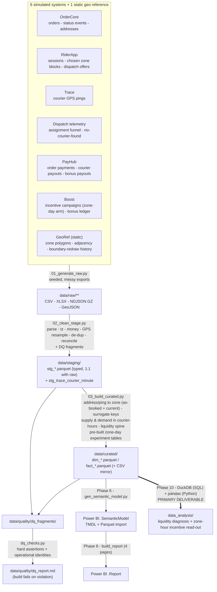

# SwiftBite Delivery — Data Architecture

**Document status:** Phase 2 deliverable.
**Depends on:** `00_scope.md`, `01_business_context_kpis.md`.
**Feeds:** Phase 3 (ETL build), Phase 4 (data dictionary / model docs), Phase 6 (semantic model), **Phase 10 (analysis — primary deliverable)**.

This is a build spec: every layer, every table, every data-quality issue Phase 3 must inject
and then handle. Scope note from Phase 0: the messy-data layer is **balanced** — 6 simulated
operational systems + a static geo reference, 8 primary data-quality issue classes. Effort is
concentrated on a curated layer that serves the **zone-hour incentive read-out** cleanly, at
the zone-day and zone-hour grains the experiment needs.

> **PT — o que é este documento.** Especificação de construção do pipeline: as três camadas
> (raw → staging → curated), cada tabela, e cada problema de dados que a Fase 3 injeta de
> propósito e depois trata. O alvo é uma camada curated limpa nos grãos **zona-dia** e
> **zona-hora**, que são as unidades do experimento.

---

## 1. Principles — medallion, seeded, idempotent

Data only ever flows downward.

| Layer | Folder | Contract |
|---|---|---|
| **Raw** | `data/raw/<source>/` | Byte-faithful simulated exports — messy, locale-specific, duplicated, encoded however the fake source system would encode it. **Never edited after generation.** Regenerated only when `SEED` / `config.py` changes. |
| **Staging** | `data/staging/` | Exactly one typed table per raw entity: `stg_<source>_<entity>.parquet`. Parsing, type coercion, encoding repair, de-duplication, timezone normalisation, GPS sanitisation, key & category normalisation. **No cross-source joins, no business logic, no metric definitions.** Every fix counted into a DQ fragment. |
| **Curated** | `data/curated/` | Conformed Kimball star: `dim_*` / `fact_*` as Parquet **and** a CSV mirror. Surrogate keys, address→zone and GPS→zone resolution (both **as-booked** and **current** zone maps), supply/demand put in the same unit (hours), the zone-hour liquidity spine, and the pre-built experiment outcome tables at zone-day grain. All money in **BRL**. |
| **Quality** | `data/quality/` | DQ fragments from staging + curated, assembled into `dq_report.md`; hard-assertion results from `dq_checks.py`. |

**Seeded.** A single `SEED` in `etl/config.py` drives every random draw. Same seed →
byte-identical raw → identical curated. **The true incentive effect and the neighbour-zone
cannibalisation term live only in `config.py`** (see §10, B1).

**Idempotent.** Each script wipes and rebuilds its own layer. `run_pipeline.py` runs
`01 → 02 → 03 → dq_checks` end to end; `dq_checks.py` exits non-zero on any violated assertion.

**Layered.** Staging reads only raw. Curated reads only staging. The semantic model (Phase 6)
and the analysis (Phase 10) read only `data/curated/*.parquet`.

---

## 2. Tech stack & run instructions

| Concern | Choice |
|---|---|
| Language | Python 3.11+ |
| Core libs | `pandas`, `numpy`, `pyarrow` (Parquet), `python-dateutil`, `openpyxl` (write messy `.xlsx`), `Faker` (`pt_BR` — names, addresses, restaurant names), `ftfy` + `unicodedata` (encoding repair), `shapely` (zone polygons + point-in-polygon for address→zone and ping→zone), `duckdb` (Phase 10 SQL track), `scipy` / `statsmodels` (Phase 10 tests — cluster-robust SEs, interaction tests; **not** used in ETL) |
| Storage | Flat files. Raw = `.csv` / `.xlsx` / `.csv.gz` / `.parquet` / `.ndjson.gz` (GPS). Staging & curated = `.parquet` (+ curated `.csv` mirror). No database server. |
| Orchestration | Plain scripts, ordered by `run_pipeline.py`. No Airflow / dbt. |
| Determinism | One `SEED`; every generator derives a named sub-seed from it. |
| GPS volume | Raw pings are the biggest object by far (~30–60 s cadence × ~900 weekly couriers). `01` writes them **partitioned by month** as gzipped NDJSON; `02` reduces them to `stg_trace_courier_minute` (courier × minute, state ∈ en_route / idle / cooldown / offline) and **does not carry raw pings forward**. One reference month is kept full for the data dictionary. |
| Windows / OneDrive | Write to a temp path in the same folder, then atomic `os.replace`; a retry-on-lock wrapper (`utils.write_parquet`, ~4 attempts, backoff) absorbs intermittent WinError 5/32 locks. |

```
# from repo root
python -m pip install -r etl/requirements.txt
python etl/run_pipeline.py            # full build: raw -> staging -> curated -> dq_checks
python etl/run_pipeline.py --from 02  # rebuild staging + curated only
python etl/gen_data_dictionary.py     # regenerate docs/03_data_dictionary.md from disk
```

Run order inside `run_pipeline.py`:

1. `01_generate_raw.py` — writes `data/raw/**`
2. `02_clean_stage.py` — writes `data/staging/stg_*.parquet` + `data/quality/dq_fragments/stg_*.json`
3. `03_build_curated.py` — writes `data/curated/{dim,fact}_*.{parquet,csv}` + curated DQ fragments
4. `dq_checks.py` — hard assertions; assembles `data/quality/dq_report.md`; non-zero exit on failure

---

## 3. Naming conventions

| Thing | Rule | Example |
|---|---|---|
| Raw file | `<source>__<entity>__<period-or-grain>.<ext>` | `ordercore__orders__2026-04.csv` |
| Staging table | `stg_<source>_<entity>` | `stg_ordercore_orders` |
| Dimension | `dim_<noun>` | `dim_zone` |
| Fact | `fact_<process>_<grain>` | `fact_zone_hour` |
| Surrogate key | `<entity>_key` — integer, curated only | `zone_key` |
| Business key | `<entity>_id` — preserved from source | `courier_id` |
| Date | `<role>_date` (date) · `<role>_date_key` (int `YYYYMMDD`) | `placed_date`, `placed_date_key` |
| Timestamp | `<role>_ts` — tz-aware, **America/Sao_Paulo** in curated | `dropoff_ts` |
| Money | `<measure>_brl` (single currency) | `basket_value_brl`, `courier_payout_brl` |
| Duration | `<measure>_min` (minutes) · `<measure>_s` (seconds) | `eta_min`, `assignment_latency_s` |
| Distance | `<measure>_km` | `trip_distance_km` |
| Rate / ratio | `<measure>_rate` / `<measure>_ratio` (0–1) | `fulfillment_rate`, `idle_courier_ratio` |
| Boolean | `is_<x>` / `has_<x>` | `is_peak_block`, `on_treated_zone_day` |
| Columns | `snake_case` throughout curated | |

Source timestamps are parsed to tz-aware UTC in staging, then curated derives the
**Brazil-local calendar day and hour** (`America/Sao_Paulo`) and every `*_date_key` from that
local day — so day-boundary, hour-block and experiment-week bucketing all land correctly, and
the PayHub UTC feed (§4 #5) is reconciled with the rest.

---

## 4. Source-system inventory

Six simulated operational systems plus one static geo reference. "Export style" is what makes
each one messy.

| # | System (fictional) | Owns | Raw entities | Export style / quirks |
|---|---|---|---|---|
| 1 | **OrderCore** (consumer order backend) | Orders of record: placement, status lifecycle, basket, delivery address, restaurant | `orders` (monthly), `order_status_events` (monthly), `addresses` | Mobile client **retries on flaky connections** → exact & near-exact duplicate `orders` / `order_status_events` rows; `placed_at` mixes `DD/MM/YYYY HH:MM` and ISO-8601; `basket_value` sometimes `"R$ 62,90"`, sometimes `62.9`; address `bairro` / `logradouro` with **encoding damage**; `delivery_zone` on older rows is the **zone as the map stood then** (see #7). |
| 2 | **RiderApp** (courier app backend) | Courier sessions, chosen work zone/block, dispatch offers and the accept/reject/timeout outcome, pickup/dropoff stamps | `courier_sessions`, `shift_zone_blocks`, `offers` | `login`/`logout` local time, no tz marker; `offers` is **at-least-once** (duplicate `offer_id`); `courier_id` free-text casing; a slice of `offers` reference a `courier_id` **absent from the courier master** (client cache lag). |
| 3 | **Trace** (location service) | Courier GPS position over time; the basis for idle vs en-route minutes | `location_pings` (NDJSON, monthly) | `ts` as **Unix-epoch milliseconds**; lat/long **jitter**, a tail of pings **hundreds of km away** (device cold-start) and `(0, 0)` nulls; ping cadence irregular (30–90 s); occasional multi-hour gaps mid-session. |
| 4 | **Dispatch telemetry** *(assignment engine log)* | Per-order assignment funnel: ready → assigned → picked-up → delivered, assignment latency, "no courier found" | `assignment_events` | One row per state transition; `no_courier_found` emitted then sometimes **followed by a late assignment** (must reconcile to a single outcome); duplicate transition rows; latency in **milliseconds as text**. |
| 5 | **PayHub** (payments & payouts) | Order payment, courier payout, tip, incentive-bonus payout | `order_payments`, `courier_payouts`, `bonus_payouts` | Entire feed in **UTC with `Z`** while everything else is Brazil-local, **no offset column**; amounts as `"1.234,56"` / `"(12,50)"` (adjustment reversals in parentheses); `competencia` (settlement week) as **Excel serial**; the **2026-05 payout file was delivered twice** with different names. |
| 6 | **Boost** (incentive / campaign system) | The experiment: per zone-day arm, bonus parameters, push radius, realised bonus spend | `incentive_campaigns`, `bonus_ledger` | Modern tool, mostly clean — but `bonus_ledger` is **at-least-once**; ~20 `incentive_campaigns` rows are **late edits** (a zone-day re-labelled after midnight) that must be reconciled to the assignment fixed at 00:00; timestamps UTC `Z`. |
| 7 | **GeoRef** *(static reference, not a live feed)* | Zone polygons, adjacency graph, area, dispatch centroid, baseline supply-stress tier, **boundary-redraw history** | `zones.geojson`, `zone_adjacency.csv`, `zone_history.csv` | Two zone polygons were **re-cut at window-month 9** (2025-09); `zones.geojson` is the **current** map, `zone_history.csv` carries the prior polygons with valid-from/to so curated can resolve the **as-booked** zone for older orders. |

`assignment_events` (#4) is the **order-outcome source of truth** (delivered vs which
cancellation); `order_status_events` (#1) is kept to cross-check and to time the customer's
own cancel. Boost (#6) corresponds to the experiment itself — a designed intervention, not
"neutral history".

---

## 5. Raw layer — what `01_generate_raw.py` emits

Volumes are approximate at `SEED` default, over the 20-month window.

| Raw file(s) | Grain | ~Rows | Key messy traits injected |
|---|---|---|---|
| `ordercore__orders__YYYY-MM.csv` | one order | ~7.5M | retry duplicates (~1.5%); mixed datetime formats; `basket_value` / `delivery_fee` sometimes text; free-text `status`; `delivery_zone` = as-booked zone label |
| `ordercore__order_status_events__YYYY-MM.csv` | order × status transition | ~28M | at-least-once duplicates; free-text status (`placed`/`PLACED`/`created`); local time no tz |
| `ordercore__addresses__YYYY-MM.csv` | delivery address | ~2.1M | `bairro`/`logradouro` mojibake; lat/long occasionally swapped; CEP with/without dash |
| `riderapp__courier_sessions.csv` | login→logout session | ~1.6M | local time no tz marker; overlapping sessions on app crash+reopen; `courier_id` casing |
| `riderapp__shift_zone_blocks.csv` | courier × chosen zone × block | ~4.4M | courier's *intended* zone (not where they ended up); free-text block labels |
| `riderapp__offers.csv` | dispatch offer | ~14M | duplicate `offer_id`; `outcome` free text (`accept`/`ACCEPTED`/`ignored`/`timeout`); ~1.5% orphan `courier_id` |
| `trace__location_pings__YYYY-MM.ndjson.gz` | courier ping | ~380M (reduced in staging) | epoch-ms `ts`; lat/long jitter; far-away & `(0,0)` pings; irregular cadence; mid-session gaps |
| `dispatch__assignment_events.csv` | order × transition | ~26M | `no_courier_found` then late assignment; duplicate transitions; latency ms-as-text |
| `payhub__order_payments.csv` | order payment | ~7.3M | UTC `Z`; amounts as locale text; Excel-serial settlement week |
| `payhub__courier_payouts.csv` | courier × settlement week × order | ~7.4M | UTC `Z`; parentheses reversals; **2026-05 file duplicated** |
| `payhub__bonus_payouts.csv` | bonus payout | ~90k | at-least-once; UTC `Z`; only exists for treated zone-days |
| `boost__incentive_campaigns.csv` | zone × date (peak block) | ~7,300 all-window / ~840 in the experiment window | ~20 post-midnight late edits to reconcile; UTC `Z`; `arm` present only for window rows |
| `boost__bonus_ledger.csv` | bonus accrual line | ~95k | at-least-once duplicates |
| `georef__zones.geojson` | zone polygon (current) | 12 | current map only |
| `georef__zone_adjacency.csv` | zone pair | ~34 | undirected edges listed once |
| `georef__zone_history.csv` | zone polygon version | ~16 | prior polygons for the 2 redrawn zones, valid-from/to |

---

## 6. Staging layer — `02_clean_stage.py`

One `stg_*` table per raw entity (plus the derived `stg_trace_courier_minute`).
Responsibilities and the DQ counter each raises:

| Fix class | What happens | DQ counter(s) |
|---|---|---|
| **Date/time parsing** | Parse `DD/MM/YYYY[ HH:MM]`, ISO-8601 (with/without TZ), **Unix-epoch ms** (Trace), **Excel serials** (PayHub settlement week). | `datetimes_parsed`, `epoch_ms_converted`, `excel_serials_converted`, `datetimes_unparseable` |
| **Timezone** | Everything → tz-aware UTC. RiderApp / OrderCore local stamps localised from `America/Sao_Paulo`; PayHub / Boost already `Z`. Flag the assumed offset on the localised feeds. | `timestamps_localized`, `utc_feeds_passthrough` |
| **Money parsing** | Strip `R$`, thousands `.`, decimal `,`; `"(x)"` → `-x`; blank → null (never 0). | `money_strings_parsed`, `money_negatives_from_parens` |
| **GPS sanitisation** | Drop pings outside the metro bounding box + `(0,0)`; clamp jitter with a max-plausible-speed filter; resample to **1-minute courier state** (en_route / idle / cooldown / offline) from ping density + session + offer state. | `gps_out_of_area_dropped`, `gps_null_island_dropped`, `gps_speed_clamped`, `ping_minutes_materialised` |
| **Encoding repair** | `ftfy.fix_text` + targeted Latin-1→UTF-8 re-decode for OrderCore addresses / restaurant names; strip BOM. | `mojibake_repaired`, `bom_stripped` |
| **De-duplication** | Drop exact/near-exact retry rows on `orders` & `order_status_events`; dedupe `offer_id` / `bonus_ledger` / duplicate assignment transitions; drop the re-delivered PayHub 2026-05 file; keep only the reconciled (00:00-fixed) Boost campaign row per zone-day. | `retry_dupes_dropped`, `dupe_events_dropped`, `redelivered_file_dropped`, `campaign_late_edits_reconciled` |
| **Outcome reconciliation** | Collapse the `assignment_events` transition log to **one outcome per order** (`no_courier_found` followed by a later assignment → `delivered`/other actual outcome); latency ms-text → int seconds. | `order_outcomes_reconciled`, `latency_coerced` |
| **Category harmonisation** | Map order `status`, offer `outcome`, vehicle type, acquisition channel, cuisine, price band to controlled vocab in `etl/vocab/`. Unknowns → explicit `"unknown"` + logged. | `categories_normalised`, `category_unknowns` |
| **Key normalisation** | Trim business keys; cast to string; null-out placeholders (`"0"`, `""`, `"N/A"`). Orphan `courier_id` left as-is for curated to sentinel. | `null_keys_flagged` |
| **Type coercion** | Enforce a declared dtype per column; failures → null + counter. | `type_coercion_failures` |

Staging does **not** join across sources, does **not** compute liquidity / fulfillment / idle
ratios, does **not** resolve address→zone, and does **not** drop rows for referential problems
— that is curated's job, fully accounted.

---

## 7. Curated layer — `03_build_curated.py`

Kimball star. `dim_date` is built first and spans **2024-06-01 → 2027-06-30** (well past the
fact window). `dim_zone` and the polygon lookup are built second (everything geo depends on
them).

### 7.1 Dimensions

| Table | Grain | Notable attributes |
|---|---|---|
| `dim_date` | calendar day | `date_key`, y/q/m/iso-week, `day_of_week`, `is_weekend`, `is_holiday_br`, `is_rainy_season`, `season_tag`, **`experiment_phase`** (pre / test / post), **`experiment_week`** (1–10 during 2026-04-06→2026-06-14, else null) |
| `dim_time_block` | hour of day (0–23) | `time_block_key`, `hour`, `daypart` (early / breakfast / lunch / afternoon / **dinner_peak** / late), **`is_peak_block`** (18:00–21:59), `block_label` |
| `dim_zone` | zone | `zone_key`, `zone_id`, `zone_name`, `macro_area` (centre / inner_ring / outer_ring), `area_km2`, `centroid_lat`, `centroid_lon`, `n_neighbours`, **`baseline_supply_stress_tier`** (short / balanced / long — fixed from months 1–15), `avg_trip_km_baseline`, `is_boundary_redrawn` |
| `dim_zone_adjacency` | zone × neighbour zone | `zone_key`, `neighbour_zone_key`, `shared_border_km` — the **bridge for the cannibalisation analysis** (adjacent = candidate to be poached from) |
| `dim_courier` | courier | `courier_key`, `courier_id`, `signup_date_key`, `signup_cohort_month`, `vehicle_type` (bike / moto / car), `home_zone_key` (modal drop-off, trailing 28d — descriptive only), `acquisition_channel`, `is_test_account` |
| `dim_customer` | customer | `customer_key`, `customer_id`, `signup_date_key`, `home_zone_key`, `customer_segment` (new / casual / regular / heavy), `is_test_account` |
| `dim_restaurant` | restaurant | `restaurant_key`, `restaurant_id`, `zone_key`, `cuisine`, `price_band` (R$ / R$$ / R$$$), `avg_prep_min_baseline` |
| `dim_incentive_campaign` | zone × date (peak block) | `campaign_key`, `zone_key`, `date_key`, **`arm`** (control / treatment), `bonus_brl_per_delivery` (0 for control), `push_radius_m`, `peak_block_start_hour`, `peak_block_end_hour`, `stratum` (zone × baseline supply-stress tier), `day_of_week` |

### 7.2 Facts

| Table | Grain | Measures / columns | Build notes |
|---|---|---|---|
| `fact_order` | one order | `order_key`, `customer_key`, `restaurant_key`, `courier_key` (sentinel −1 if never assigned / −2 orphan), `pickup_zone_key`, **`dropoff_zone_key_asbooked`**, **`dropoff_zone_key_current`**, `placed_date_key`, `placed_ts`, `placed_hour`, `time_block_key`, `is_peak_block`, `basket_value_brl`, `delivery_fee_brl`, `outcome` (delivered / cancelled_customer / cancelled_courier / cancelled_no_courier / cancelled_restaurant), `eta_min` (null unless delivered), `assignment_latency_s`, `trip_distance_km`, `experiment_phase`, **`on_treated_zone_day`**, **`is_adjacent_to_treated_zone_day`** | Retry-deduped. Address → zone by point-in-polygon against **both** the current and the as-of-order-date polygon set; the experiment uses `_asbooked`, trend geography uses `_current`. `outcome` from reconciled `assignment_events`. |
| `fact_delivery` | one completed delivery | `delivery_key`, `order_key`, `courier_key`, `zone_key` (= dropoff as-booked), `pickup_ts`, `dropoff_ts`, `trip_distance_km`, `trip_min`, `courier_base_payout_brl`, `tip_brl`, `incentive_bonus_brl`, `total_payout_brl`, `is_peak_block`, `experiment_phase`, `on_treated_zone_day` | One row per `outcome = delivered`. `incentive_bonus_brl` joined from `bonus_payouts` / `bonus_ledger` (reconciled); non-zero only on treated zone-day peak blocks. |
| `fact_courier_shift_block` | courier × zone × date × hour-block | `courier_key`, `zone_key`, `date_key`, `time_block_key`, `logged_in_min`, `active_min` (en-route), `idle_min`, `cooldown_min`, `deliveries`, `base_payout_brl`, `tip_brl`, `bonus_brl`, `earnings_brl` | Built from `stg_trace_courier_minute` + sessions + offers + deliveries. `zone_key` = the zone the courier's position was in for that minute-majority. The **supply** side of liquidity. |
| `fact_zone_hour` | zone × date × hour | `zone_key`, `date_key`, `time_block_key`, `is_peak_block`, `orders_placed`, `orders_delivered`, `cancelled_customer`, `cancelled_courier`, `cancelled_no_courier`, `cancelled_restaurant`, **`fulfillment_rate`**, `eta_p50_min`, `eta_p90_min`, `assignment_latency_p90_s`, `available_courier_hours`, `demanded_delivery_hours`, **`liquidity_ratio`**, `active_couriers`, `idle_courier_hours`, **`idle_courier_ratio`**, `unmet_demand`, `is_rainy`, `has_local_event`, **`experiment_arm`** (peak-block window rows only), `on_treated_zone_day`, `is_adjacent_to_treated_zone_day` | **The liquidity spine and the report's workhorse.** `demanded_delivery_hours` = `orders_placed` × the period-average service time (pickup + drive + drop). `available_courier_hours` = Σ `fact_courier_shift_block` (active + idle) for the zone-hour. `liquidity_ratio` = available ÷ demanded. |
| `fact_incentive_assignment` | zone-day (peak block), experiment window | `zone_key`, `date_key`, `campaign_key`, `arm`, `bonus_brl_per_delivery`, `stratum`, `day_of_week`, `n_adjacent_zones_treated_same_day`, `is_adjacent_to_treated`, **pre-period covariates frozen at 2026-04-05**: `pre_fulfillment_rate`, `pre_eta_p90_min`, `pre_orders_placed_mean`, `pre_liquidity_ratio`, `pre_idle_courier_ratio` | ~840 rows. Late-edited campaign rows reconciled to the 00:00 assignment. Covariates from the 15-month baseline; used for the SRM / balance checks and variance reduction in Phase 10. |
| `fact_experiment_zone_day` | zone-day (peak block), experiment window | `zone_key`, `date_key`, `arm`, `stratum`, **`fulfillment_rate`** (primary), `orders_placed`, `orders_delivered`, `eta_p50_min`, `eta_p90_min`, `cancel_rate`, `cancel_no_courier_rate`, `available_courier_hours`, `active_couriers`, `courier_earnings_per_active_hour_brl`, `deliveries`, `incentive_spend_brl`, **`incentive_cost_per_delivered_order_brl`**, `n_adjacent_zones_treated`, `is_adjacent_to_treated` | ~840 rows — **one tidy row per unit of randomization**, every metric the read-out needs pre-computed so Phase 10 goes straight to tests and the report needs almost no DAX. |
| `fact_experiment_zone_block_week` | zone × experiment-week × peak hour-block | `zone_key`, `experiment_week`, `time_block_key`, `arm`, `fulfillment_rate`, `orders_placed`, `orders_delivered`, `eta_p90_min`, `available_courier_hours` | The **weekly × block series** for the novelty / decay diagnostic and the time-of-peak cut. |
| `fact_targets_zone_hour` | zone × hour-of-day × kpi | `target_value` | Plan from doc 01 §10; same basis as actuals. |

### 7.3 Cross-cutting curated rules

- **Two zone maps.** Every order gets `dropoff_zone_key_asbooked` (polygon set valid on the
  order date) **and** `dropoff_zone_key_current` (today's map). The experiment and all
  zone-day/zone-hour facts key off **as-booked** — the incentive was assigned on the map in
  force at the time. Trend geography on the report uses **current**. Drift-row count reported.
- **Supply and demand in one unit.** Both `available_courier_hours` and
  `demanded_delivery_hours` are in courier-hours, so `liquidity_ratio` is dimensionless and
  comparable across zones and hours.
- **Idle vs active.** Derived from `stg_trace_courier_minute`: a logged-in minute is `active`
  if the courier is on an accepted offer through dropoff, `cooldown` for a short post-dropoff
  window, else `idle`. Idle minutes are attributed to the zone the courier was physically in.
- **Sentinel keys.** `courier_key = -1` (no courier ever assigned — the `cancelled_no_courier`
  path), `-2` (orphan — courier id not in master). Facts are **never dropped** for a missing
  dimension; the sentinel is used and counted.
- **Experiment stamping.** `arm` / `on_treated_zone_day` / `is_adjacent_to_treated_zone_day`
  are resolved from `fact_incentive_assignment` (via zone_key + date_key) and stamped onto
  `fact_order` and `fact_zone_hour` peak-block rows, so the report can slice liquidity by arm
  without touching the experiment facts.
- **Adjacency-aware spillover flags.** `is_adjacent_to_treated_zone_day` = the zone is a
  control zone that day **and** at least one `dim_zone_adjacency` neighbour was treated that
  day. `n_adjacent_zones_treated` carries the count. These drive guardrail **G5**.
- **Local calendar** (`America/Sao_Paulo`) drives every `*_date_key`, `placed_hour` and the
  experiment-week bucketing; the PayHub/Boost UTC feeds are converted before keying.
- **BRL only.** Every money column is `*_brl`. No `_usd` sibling, no FX table.
- **Lapse/– style honesty.** `fact_zone_hour.fulfillment_rate` is null (not 0) for a
  zone-hour with `orders_placed = 0`. Rates are never computed on a zero denominator.

---

## 8. Data-quality issue catalogue (the injection list)

Eight **primary** classes — injected by `01`, handled by `02`/`03`, counted into a DQ
fragment, and (where an invariant) asserted in `dq_checks.py`.

| # | Issue | Injected in | Handled in | Hard check |
|---|---|---|---|---|
| Q01 | **Multiple date/time formats + Unix-epoch ms + Excel serials** | ordercore, riderapp, trace (epoch-ms), payhub (serial), boost | staging datetime parser | `datetimes_unparseable = 0` |
| Q02 | **Timezone drift** — PayHub & Boost in UTC `Z`, no offset, while OrderCore/RiderApp are Brazil-local with no marker | payhub, boost vs ordercore, riderapp | staging: localise the naive feeds, pass through the `Z` feeds, reconcile in curated to local day/hour | no naive timestamps in curated; peak-block bucketing exact against `America/Sao_Paulo` |
| Q03 | **Money as locale strings / parentheses negatives / symbol-in-value** | ordercore `basket_value`, payhub amounts | staging money parser | no non-null money column is object dtype; `total_payout_brl ≥ 0`; `basket_value_brl > 0` for placed orders |
| Q04 | **GPS noise & out-of-area pings** — lat/long jitter, far-away cold-start pings, `(0,0)` nulls, irregular cadence | trace `location_pings` | staging GPS sanitiser (bbox + speed filter + 1-minute resample) | 0 pings outside the metro bbox survive into `stg_trace_courier_minute`; courier-minute state ∈ controlled set |
| Q05 | **Duplicate rows** — mobile retry dupes, at-least-once event/offer/bonus logs, re-delivered PayHub month | ordercore, riderapp, dispatch, payhub, boost | staging de-dup (near-dup collapse / dedupe on id / drop re-delivered file) | `fact_order` unique on `order_id`; `fact_delivery` unique on `delivery_id`; `fact_experiment_zone_day` unique on (`zone_key`,`date_key`) |
| Q06 | **Missing master rows / orphan keys** — `offers` & trip rows for a `courier_id` absent from the courier master | riderapp, dispatch | curated sentinel `courier_key = -2` + count | every fact FK resolves to a real or sentinel key; orphan count reported |
| Q07 | **Zone boundary redraw** — current `zones.geojson` disagrees with the as-of-date polygons for 2 zones from window-month 9 | georef | curated resolves **both** `_asbooked` and `_current` zone keys; experiment keys off `_asbooked` | every order has a non-null `dropoff_zone_key_asbooked`; as-booked ≠ current drift-row count reported (expected in the 2 redrawn zones only) |
| Q08 | **Encoding damage (Latin-1 mojibake, BOM)** | ordercore addresses & restaurant names | `ftfy` + targeted re-decode | no `Ã`/`Â` mojibake sequences remain in `dim_restaurant.restaurant_id` labels or address fields feeding `dim_zone` names |

**Also handled, without ceremony** (minor, single counter each): null/placeholder keys →
sentinels; negative or out-of-range durations/distances → clamped + counted; `no_courier_found`
→ late-assignment reconciliation; Boost post-midnight campaign edits → 00:00 assignment wins;
offer/status/vehicle/cuisine free-text → controlled vocab.

`dq_checks.py` also asserts the **operational identities**:

- **Order conservation**, per zone-hour: `orders_placed = orders_delivered + cancelled_customer
  + cancelled_courier + cancelled_no_courier + cancelled_restaurant` (exact).
- **Supply tie-out:** `fact_zone_hour.available_courier_hours` == Σ (`active_min` + `idle_min`)
  ÷ 60 from `fact_courier_shift_block` for the same zone-hour, within 0.5%.
- **Rate sanity:** `fulfillment_rate ∈ [0, 1]`; `eta_p50_min ≤ eta_p90_min`;
  `liquidity_ratio ≥ 0`; `idle_courier_ratio ∈ [0, 1]`.
- **Delivery/payout tie-out:** Σ `fact_delivery.total_payout_brl` == Σ
  `fact_courier_shift_block.earnings_brl` within 0.5%; Σ `incentive_bonus_brl` ==
  `boost` reconciled bonus spend within 0.5%.
- **Experiment integrity:** every `fact_experiment_zone_day` / `fact_experiment_zone_block_week`
  key ∈ `fact_incentive_assignment`; treated zone-days have `bonus_brl_per_delivery > 0`,
  control `= 0`; per-stratum allocation ratio ∈ [0.45, 0.55] (a *build-time* sanity check —
  the real SRM test is on observed data in Phase 10); pre-period covariates present for all
  ~840 units; fact data extends ≥ 75 days past 2026-06-14.
- **Benchmark bands:** fulfillment rate, ETA p50/p90, cancellation rate, idle-courier ratio,
  liquidity ratio and courier earnings per active hour all land inside their doc 01 §9 ranges
  for the **pre-experiment baseline** period (the experiment arms are allowed to diverge
  in-window — that is the point).

---

## 9. Architecture diagram



---

## 10. Open items carried into Phase 3

| # | Item | Resolution plan |
|---|---|---|
| B1 | **The true incentive effect** — primary lift on fulfillment rate, per-tier heterogeneity profile (large in supply-**short** zones, ≈ 0 in supply-**long**), novelty-decay shape, guardrail impacts (ETA p90 down, no-courier cancels down, courier earnings up), **and the neighbour-zone cannibalisation term** | **Decided in Phase 3**, encoded in `config.py` as tunable effect sizes + noise; kept out of docs 00/01; detected blind in Phase 10. Design intent: a real, non-trivial but not-obvious pooled lift, concentrated in short zones; a modest early novelty bump that decays over the 10 weeks; **guardrail G1 (incentive cost per incremental delivered order) deliberately lands near the contribution-margin threshold** so it needs a careful read; cannibalisation real but partial (metro net lift ≈ 70–85% of the summed local lift). |
| B2 | Courier **supply model** — session start/stop, zone choice, and the elasticity of zone presence to expected earnings and to the bonus | Seeded discrete-choice model over zones per block; the bonus shifts the utility of a treated zone; the elasticity parameter is the structural quantity Phase 10 must recover. Calibrate so baseline supply-short zone-hours ≈ 8–12% of peak. |
| B3 | Row volumes vs targets (~7.5M orders; ~380M raw pings) and the GPS reduction step | First regeneration pass calibrates population and activity rates; confirm `stg_trace_courier_minute` reduces pings ~100× and the pipeline runs end-to-end in a sane time on this box. |
| B4 | Benchmark-band calibration (fulfillment, ETA p50/p90, cancellation rate, idle ratio, liquidity ratio, courier earnings/hr) | Several regeneration passes until the pre-experiment baseline sits mid-band for every doc 01 §9 KPI. |
| B5 | Zone geometry — 12 polygons, adjacency graph, dispatch centroids, baseline supply-stress tier assignment, and the 2 mid-window redraws | Hand-authored `zones.geojson` (a stylised 12-cell tiling of a metro) + `zone_history.csv`; tiers assigned from the calibrated baseline liquidity, not by hand. |
| B6 | BR calendar, rainy-season curve, local-event calendar (football / shows by zone) | Static lookups in `etl/vocab/` (`br_calendar.csv`, `rainy_season.csv`, `local_events.csv`); seasonal + weather multipliers in `config.py`. |
| B7 | Exact experiment sizing — eligible zone-days, per-stratum counts, day-of-week balancing | Generator targets 12 zones × ~70 window-days; assignment draws 50/50 within each (zone × supply-stress tier) cell, balanced on weekday/weekend; confirm ≈ 420 zone-days/arm and ≥ ~140 in the short tier per arm (doc 01 §5.4). |

---

*End of Phase 2 deliverable.*
