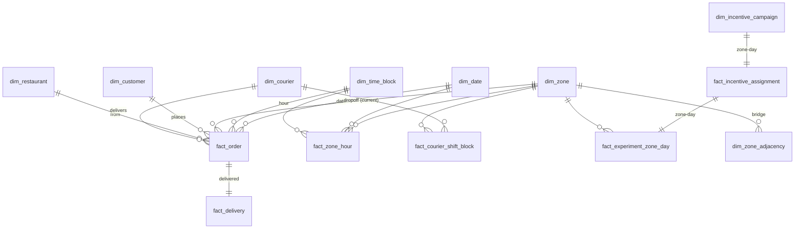

# SwiftBite Delivery — Data Model

**Document status:** Phase 4 deliverable. **Depends on:** `02_data_architecture.md`,
`03_data_dictionary.md` (auto-generated). Describes the curated star as it will be imported
into the Power BI semantic model (Phase 6).

> **PT.** O star curado: matriz de barramento (fatos × dimensões), grão e medidas de cada
> fato, atributos de cada dimensão, e as relações físicas para o modelo semântico.

---

## 1. Bus matrix (facts × dimensions)

| Fact ↓ / Dim → | date | time_block | zone | courier | customer | restaurant | incentive_campaign |
|---|:--:|:--:|:--:|:--:|:--:|:--:|:--:|
| `fact_order` | ● | ● | ● (dropoff current; +asbooked, pickup inactive) | ● | ● | ● | (via zone+date) |
| `fact_delivery` | ● (dropoff_ts) | ● | ● | ● | (via order) | (via order) | (via zone+date) |
| `fact_courier_shift_block` | ● | ● | ● | ● | | | (via zone+date) |
| `fact_zone_hour` | ● | ● | ● | | | | (via zone+date) |
| `fact_incentive_assignment` | ● | | ● | | | | ● |
| `fact_experiment_zone_day` | ● | | ● | | | | ● |
| `fact_experiment_zone_block_week` | ● | ● | ● | | | | ● |

`●` = direct relationship; `(via …)` = reachable through another table, not a physical
relationship. Every fact carries `date_key` (int `YYYYMMDD`) → `dim_date[date_key]` (day
grain, unique) and, where relevant, `time_block_key` (0–23) → `dim_time_block`.

---

## 2. Fact tables — grain & measures

| Fact | Grain | Additive measures | Non-additive / semi-additive |
|---|---|---|---|
| `fact_order` | one placed order | `basket_value_brl`, `delivery_fee_brl`, count | `outcome`, `eta_min` (delivered only), `assignment_latency_s`, `trip_distance_km`, `is_peak_block`, `on_treated_zone_day`, `is_adjacent_to_treated_zone_day` |
| `fact_delivery` | one delivered order | `trip_min`, `trip_distance_km`, `courier_base_payout_brl`, `tip_brl`, `incentive_bonus_brl`, `total_payout_brl` | `on_treated_zone_day`, `experiment_phase` |
| `fact_courier_shift_block` | courier × zone × date × hour | `logged_in_min`, `active_min`, `idle_min`, `cooldown_min`, `deliveries`, `base_payout_brl`, `tip_brl`, `bonus_brl`, `earnings_brl` | `is_peak_block` |
| `fact_zone_hour` | zone × date × hour | `orders_placed`, `orders_delivered`, `cancelled_{customer,courier,no_courier,restaurant}`, `unmet_demand`, `demanded_delivery_hours`, `available_courier_hours`, `idle_courier_hours` | `fulfillment_rate`, `eta_p50_min`, `eta_p90_min`, `assignment_latency_p90_s`, `liquidity_ratio`, `idle_courier_ratio`, `active_couriers`, `is_rainy`, `has_local_event`, `experiment_arm` |
| `fact_incentive_assignment` | experiment zone-day (~840) | count | `arm`, `bonus_brl_per_delivery`, `stratum`, `day_of_week`, `n_adjacent_zones_treated`, `is_adjacent_to_treated`, `pre_fulfillment_rate`, `pre_eta_p90_min`, `pre_orders_placed_mean`, `pre_liquidity_ratio`, `pre_idle_courier_ratio` |
| `fact_experiment_zone_day` | experiment zone-day (~840) | `orders_placed`, `orders_delivered`, `deliveries`, `cancelled_no_courier`, `available_courier_hours`, `incentive_spend_brl` | **`fulfillment_rate` (primary)**, `eta_p50_min`, `eta_p90_min`, `cancel_rate`, `cancel_no_courier_rate`, `courier_earnings_per_active_hour_brl`, `incentive_cost_per_delivered_order_brl`, `active_couriers`, `arm`, `stratum`, `n_adjacent_zones_treated`, `is_adjacent_to_treated` |
| `fact_experiment_zone_block_week` | zone × experiment week × peak hour-block | `orders_placed`, `orders_delivered`, `available_courier_hours` | `fulfillment_rate`, `eta_p90_min`, `arm` |

`fact_experiment_zone_day` and `fact_incentive_assignment` share the (`zone_key`,`date_key`)
key 1:1 — assignment carries the design + frozen covariates, the outcome table carries the
realised metrics. Phase 10 joins them; the report reads the outcome table directly.

---

## 3. Dimensions — key attributes

| Dimension | Key | Attributes used in the report |
|---|---|---|
| `dim_date` | `date_key` (int `YYYYMMDD`) | `year`, `quarter`, `month`, `month_name`, `iso_week`, `day_of_week`, `is_weekend`, `is_holiday_br`, `is_rainy_season`, `experiment_phase`, `experiment_week` |
| `dim_time_block` | `time_block_key` (hour 0–23) | `hour`, `daypart`, `is_peak_block`, `block_label` |
| `dim_zone` | `zone_key` | `zone_id`, `zone_name`, `macro_area`, `area_km2`, `centroid_lat/lon`, `n_neighbours`, **`baseline_supply_stress_tier`**, `avg_trip_km_baseline`, `is_boundary_redrawn` |
| `dim_zone_adjacency` | (`zone_key`, `neighbour_zone_key`) | bridge — feeds the cannibalisation / spillover measures |
| `dim_courier` | `courier_key` | `signup_cohort_month`, `vehicle_type`, `acquisition_channel`, `home_zone_key`, `is_test_account` |
| `dim_customer` | `customer_key` | `customer_segment`, `home_zone_key` |
| `dim_restaurant` | `restaurant_key` | `zone_key`, `cuisine`, `price_band` |
| `dim_incentive_campaign` | `campaign_key` (also unique on `zone_key`+`date_key`) | `arm`, `bonus_brl_per_delivery`, `push_radius_m`, `peak_block_start_hour`, `peak_block_end_hour`, `stratum`, `day_of_week` |

**Sentinel keys.** `courier_key = -1` (no courier ever assigned — the `cancelled_no_courier`
path), `-2` (orphan courier id not in the master). Facts are never dropped for a missing
dimension row.

---

## 4. Relationships

| From (fact) | Column | To | Column | Card. | Cross-filter | Active |
|---|---|---|---|---|---|---|
| `fact_order` | `placed_date_key` | `dim_date` | `date_key` | * : 1 | single | yes |
| `fact_order` | `time_block_key` | `dim_time_block` | `time_block_key` | * : 1 | single | yes |
| `fact_order` | `dropoff_zone_key_current` | `dim_zone` | `zone_key` | * : 1 | single | **yes** |
| `fact_order` | `dropoff_zone_key_asbooked` | `dim_zone` | `zone_key` | * : 1 | single | inactive |
| `fact_order` | `pickup_zone_key` | `dim_zone` | `zone_key` | * : 1 | single | inactive |
| `fact_order` | `customer_key` | `dim_customer` | `customer_key` | * : 1 | single | yes |
| `fact_order` | `restaurant_key` | `dim_restaurant` | `restaurant_key` | * : 1 | single | yes |
| `fact_order` | `courier_key` | `dim_courier` | `courier_key` | * : 1 | single | yes |
| `fact_delivery` | `order_key` | `fact_order` | `order_key` | 1 : 1 | single | yes (or merged) |
| `fact_delivery` | `courier_key` | `dim_courier` | `courier_key` | * : 1 | single | yes |
| `fact_delivery` | `zone_key` | `dim_zone` | `zone_key` | * : 1 | single | yes |
| `fact_courier_shift_block` | `courier_key` | `dim_courier` | `courier_key` | * : 1 | single | yes |
| `fact_courier_shift_block` | `zone_key` | `dim_zone` | `zone_key` | * : 1 | single | yes |
| `fact_courier_shift_block` | `date_key` / `time_block_key` | `dim_date` / `dim_time_block` | key | * : 1 | single | yes |
| `fact_zone_hour` | `zone_key` | `dim_zone` | `zone_key` | * : 1 | single | yes |
| `fact_zone_hour` | `date_key` / `time_block_key` | `dim_date` / `dim_time_block` | key | * : 1 | single | yes |
| `fact_incentive_assignment` | `campaign_key` | `dim_incentive_campaign` | `campaign_key` | * : 1 | single | yes |
| `fact_incentive_assignment` | `zone_key` / `date_key` | `dim_zone` / `dim_date` | key | * : 1 | single | yes |
| `fact_experiment_zone_day` | `zone_key` / `date_key` | `dim_zone` / `dim_date` | key | * : 1 | single | yes |
| `fact_experiment_zone_block_week` | `zone_key` / `date_key` / `time_block_key` | `dim_zone` / `dim_date` / `dim_time_block` | key | * : 1 | single | yes |

`dim_zone_adjacency` is a **bridge**: `dim_zone[zone_key] 1 : * dim_zone_adjacency[zone_key]`,
and `dim_zone_adjacency[neighbour_zone_key]` is used by measures (not a physical
relationship) to sum a metric over a zone's neighbours for the spillover guardrail.

`fact_order` carries three zone roles; only **dropoff (current)** is the active
relationship. `dropoff (as-booked)` and `pickup` are inactive relationships activated with
`USERELATIONSHIP` inside specific measures (as-booked drift; pickup-zone supply).

---

## 5. Measure groups (Phase 7 preview)

Marketplace Health (fulfillment, ETA p50/p90, cancellation by cause, assignment latency) ·
Liquidity (available vs demanded courier-hours, liquidity ratio, idle-courier ratio,
unmet demand, spatial-mismatch index) · Supply & Couriers (active couriers, CAC,
retention, deliveries/active-hour) · Courier Economics (earnings/active-hour, utilisation,
contribution margin, incentive spend, **incentive cost per incremental delivered order**) ·
**Experiment** (fulfillment by arm + lift + cluster-robust CI + p + RI p, weekly series,
balance, guardrails G1–G5, effect by tier + interaction, neighbour-zone spillover,
cannibalisation-adjusted net) · Time Intelligence (WoW, trailing-4-week, YoY context) ·
Targets vs Plan · a dynamic `Exec Insight` narrative measure.

*End of Phase 4 deliverable (Data Model).*
