# 02 — Data Architecture

How raw, messy, multi-source data becomes a clean, documented star schema that Power BI
consumes. The design follows a **medallion architecture** (raw → staging → curated) with a
seeded, reproducible Python pipeline.

---

## 1. Design principles

| Principle | How it's applied |
|---|---|
| **Reproducible** | Single random seed (`etl/config.py`). Re-running `run_pipeline.py` reproduces byte-identical data. |
| **Layered** | Each layer has one job. Raw is never edited; staging is deterministic from raw; curated is deterministic from staging. |
| **Idempotent** | Every script fully rewrites its outputs. No incremental state, no partial runs. |
| **Source-faithful** | Raw files imitate real system exports — different schemas, formats, encodings, and the data-quality problems those systems actually produce. |
| **Documented** | Every table and column is described in [`03_data_dictionary.md`](03_data_dictionary.md). Every transformation in [`04_etl_pipeline.md`](04_etl_pipeline.md). |
| **Tested** | `dq_checks.py` runs assertions (row counts, keys, referential integrity, null rules, value ranges, accounting identities) and fails the build on violation. |
| **BI-ready** | Curated layer is a Kimball-style star schema: conformed dimensions, additive facts, surrogate keys, a real date dimension. |

---

## 2. Layer overview

```mermaid
flowchart LR
    subgraph SRC["Source systems (simulated)"]
        S1["Storefront / OMS<br/>orders, order lines"]
        S2["ERP – product &amp; cost master"]
        S3["Procurement<br/>purchase orders, receipts"]
        S4["WMS<br/>inventory movements &amp; snapshots"]
        S5["Payment processor (PSP)<br/>transactions, fees, settlement"]
        S6["Web analytics (GA4-style)"]
        S7["Google Ads"]
        S8["Meta Ads"]
        S9["CRM – customer master"]
        S10["Support desk (Zendesk-style)"]
        S11["Carrier tracking (nested JSON)"]
        S12["Finance – FX rates &amp; targets"]
    end

    subgraph RAW["data/raw/ — Bronze"]
        R["Messy exports<br/>CSV · XLSX · JSON<br/>mixed formats, dupes, nulls, encodings"]
    end
    subgraph STG["data/staging/ — Silver"]
        T["Cleaned · typed · deduplicated<br/>conformed keys · standardized<br/>Parquet + CSV"]
    end
    subgraph CUR["data/curated/ — Gold"]
        D["Star schema<br/>dim_* + fact_*<br/>surrogate keys · USD conversion<br/>moving-avg COGS · derived snapshots<br/>Parquet + CSV"]
    end
    subgraph BI["Power BI"]
        MOD["Semantic model<br/>relationships + DAX"]
        RPT["Executive report"]
    end

    SRC -->|01_generate_raw.py| RAW
    RAW -->|02_clean_stage.py| STG
    STG -->|03_build_curated.py| CUR
    CUR --> MOD --> RPT
    CUR -.->|dq_checks.py| Q["data/quality/dq_report.md"]
```



### Bronze — `data/raw/`
Generated by `01_generate_raw.py`. Files look like exports pulled by an analyst on their
first day: no two systems agree on formats, and each carries its own defects (§4).
**Nothing downstream ever writes here.**

### Silver — `data/staging/`
Produced by `02_clean_stage.py`. One staging table per meaningful entity. Work done:
parsing and typing (dates, money, booleans), trimming/casing, de-duplication, currency
normalization, category/brand standardization, unioning the two ad platforms, flattening
the carrier JSON, resolving customer identity, and reconciling PSP transactions to orders.
Every row dropped or altered is logged to the DQ report.

### Gold — `data/curated/`
Produced by `03_build_curated.py`. The dimensional model:

**Dimensions**

| Table | Notes |
|---|---|
| `dim_date` | 2024-07-01 → 2026-06-30 + buffer; fiscal cols, holiday flags (US/UK/DE/BR), promo-period flag |
| `dim_market` | US/UK/DE/BR: currency, `live_date`, `is_comparable_base` |
| `dim_customer` | Acquisition channel & date, geography, segment, loyalty tier, marketing consent |
| `dim_geography` | Country → region → state/city (per-market hierarchy) |
| `dim_product` | Category → Subcategory → Brand → Product; launch date, `is_active`, weight, warranty months |
| `dim_supplier` | Country, `payment_terms_days` (Net 30/45/60), `lead_time_days`, on-time-supply reliability |
| `dim_channel` | Organic Search, Paid Search, Paid Social, Display, Email, Direct, Affiliate, Referral |
| `dim_campaign` | Type, market, start/end, target segment |
| `dim_payment_method` | `method_group`, `card_scheme`, `mdr_pct`, `fixed_fee_local`, `settlement_days`, instalment attributes, `available_markets` |
| `dim_carrier` | Market, service level, baseline SLA days |
| `dim_currency` | USD/EUR/GBP/BRL; `is_reporting_currency` |

**Facts**

| Table | Grain | Key measures |
|---|---|---|
| `fact_order_lines` | order line (order × product × line_type) | qty, unit_price, discount, gross/net revenue, COGS (moving-avg), margin — `*_local` + `*_usd` |
| `fact_orders` | order header | order total, payment_method_key, `installment_count`, `installment_plan`, `payment_fee`, tax, shipping fee/cost, promised & delivered dates, status |
| `fact_payment_schedule` | order × settlement tranche | `installment_number`, `due_date`, gross / fee / financing_cost / net amount |
| `fact_purchase_orders` | PO × SKU | qty ordered, unit cost, PO value, expected/actual receipt date, supplier payment due & paid dates |
| `fact_inventory_movement` | movement | type (receipt/sale/return_to_stock/adjustment/transfer), qty ±, unit cost, value |
| `fact_inventory_snapshot` | month-end × SKU × warehouse | units on hand / in transit / reserved, unit cost, inventory value, days of cover — **derived from the movement ledger** |
| `fact_web_traffic_daily` | date × market × channel × device | sessions, users, pageviews, bounces, add-to-carts, carts, orders-attributed |
| `fact_marketing_spend` | date × market × channel × campaign | spend, impressions, clicks — `*_local` + `*_usd` |
| `fact_returns` | return line | returned qty, refund value, reason code, condition |
| `fact_support_tickets` | ticket | created/resolved timestamps, category, priority, first-contact-resolution flag, CSAT |
| `fact_exchange_rate` | date × currency | rate to USD |
| `fact_target` | month × market × metric | target value |

- Surrogate integer keys on every dimension; facts carry keys + measures + a few
  degenerate dimensions (`order_id`, `po_number`, `ticket_id`).
- Money columns stored as `*_local` **and** `*_usd` (converted at transaction-date rate).
- Both Parquet (Power BI / analytical use) and CSV (portability, review) written for every
  curated table.

---

## 3. Source system inventory

| # | Simulated system | Represents | Raw file(s) | Format |
|---|---|---|---|---|
| 1 | Storefront / OMS | Orders, order lines, customer-as-seen-at-checkout | `oms_orders.csv`, `oms_order_lines.csv` | CSV |
| 2 | ERP | Product master, unit-cost history, supplier links | `erp_products.xlsx` | XLSX (multi-sheet) |
| 3 | Procurement | Purchase orders, receipts, supplier terms | `procurement_purchase_orders.csv`, `suppliers.csv` | CSV |
| 4 | WMS | Inventory movements + month-end snapshots | `wms_inventory_movements.csv`, `wms_inventory_snapshots.csv` | CSV |
| 5 | Payment processor (PSP) | Transaction-level auth, fees, settlement dates, instalment plans | `psp_transactions.csv` | CSV |
| 6 | Web analytics | Daily sessions / engagement / funnel by market·channel·device | `web_analytics_daily.csv` | CSV |
| 7 | Google Ads | Daily paid-search spend, impressions, clicks, campaign | `google_ads_report.csv` | CSV |
| 8 | Meta Ads | Daily paid-social spend, impressions, clicks (different column names/currency) | `meta_ads_export.csv` | CSV |
| 9 | CRM | Customer master: acquisition, geography, segment, consent | `crm_customers.csv` | CSV |
| 10 | Support desk | Support tickets: category, timestamps, CSAT | `support_tickets.csv` | CSV |
| 11 | Carrier tracking | Shipment + tracking events per order | `carrier_tracking.json` | JSON (nested) |
| 12 | Finance | Daily FX rates to USD; monthly plan/targets by market | `fx_rates.csv`, `finance_targets.csv` | CSV |

---

## 4. Data-quality issues deliberately injected

Handled by `02_clean_stage.py`; every occurrence is counted in the DQ report.

| Area | Injected problem | Cleaning response |
|---|---|---|
| Dates | Mixed formats (`2025-03-05`, `03/05/2025`, `5-Mar-2025`), some Excel serials | Multi-format parse → ISO `date` |
| Money | `"$1,299.00"`, `"1.299,00"` (EU), `"R$ 1.299,00"`, blanks | Locale-aware parse → decimal |
| Customers | Duplicate rows, `EMAIL` vs `email`, trailing spaces, mixed casing, ~2% null email | Dedup on natural key, normalize, flag missing email |
| Products | Category spelled 3 ways (`Smartphones`/`smart phones`/`Smart-Phones`), brand casing | Mapping table → canonical category / brand |
| Ad platforms | Google vs Meta: different column names, currencies, date grains | Rename to common schema, convert to USD, align to daily |
| PSP ↔ OMS | ~1% of PSP transactions don't match an order id; a few orders have no PSP row | Reconciliation report; unmatched flagged, not force-joined |
| Web analytics | ~1.5% of dates missing; occasional negative / double-counted sessions | Gap report, clamp/flag anomalies |
| Orders | ~0.5% duplicated order lines; a few order ids with no customer; negative quantities | Dedup, orphan report, route negatives to returns |
| Carrier JSON | Nested events array; status vocab `delivered`/`DELIVERED`/`Delivery complete` | Flatten, status-vocabulary map |
| Encoding | UTF-8 vs Latin-1 in Brazil rows (`São Paulo`) | Encoding detection + fix |
| Referential | Some SKUs in orders not in product master (discontinued) | Late-arriving-dimension stub + report |
| Inventory | Movement ledger vs snapshot disagree for a few SKU-warehouses | Reconcile to ledger; variance reported |

---

## 5. Tech stack

| Tool | Use |
|---|---|
| **Python 3.12** | Pipeline language |
| **pandas** | Transformations |
| **pyarrow** | Parquet I/O |
| **NumPy** | Seeded random generation, statistical patterns |
| **Faker** | Synthetic names, addresses, emails (seeded) |
| **openpyxl** | Read/write the ERP `.xlsx` |
| **python-dateutil** | Multi-format date parsing |
| **DuckDB** *(optional)* | Ad-hoc SQL validation of curated layer |
| **Power BI Desktop** | Semantic model + report |
| **pbir CLI** | Version-controlled Power BI project (`.pbip` / PBIR) |

`etl/requirements.txt` pins exact versions.

---

## 6. Running & refreshing

```bash
cd etl
python -m pip install -r requirements.txt
python run_pipeline.py     # 01_generate_raw → 02_clean_stage → 03_build_curated → dq_checks
```

| Step | Script | Reads | Writes |
|---|---|---|---|
| 1 | `01_generate_raw.py` | `config.py` | `data/raw/*` |
| 2 | `02_clean_stage.py` | `data/raw/*` | `data/staging/*`, DQ log fragments |
| 3 | `03_build_curated.py` | `data/staging/*` | `data/curated/*` |
| 4 | `dq_checks.py` | `data/curated/*` | `data/quality/dq_report.md` (exit ≠ 0 on failure) |

Power BI connects to `data/curated/*.parquet` via a parameterized folder path
(`pDataFolder`), so the report is portable: change one parameter to point at the curated
folder on any machine.

---

## 7. Naming conventions

| Object | Convention | Example |
|---|---|---|
| Raw files | `<system>_<entity>.<ext>`, snake_case | `google_ads_report.csv` |
| Staging tables | `stg_<entity>` | `stg_order_lines` |
| Curated dims | `dim_<entity>` (singular) | `dim_customer` |
| Curated facts | `fact_<process>` | `fact_order_lines` |
| Surrogate keys | `<entity>_key` (int) | `customer_key` |
| Natural/business keys | `<entity>_id` / `<entity>_number` (from source) | `order_id`, `po_number` |
| Money columns | `<measure>_local` / `<measure>_usd` | `net_revenue_usd` |
| Dates | ISO `date`; keys as `yyyymmdd` int | `order_date`, `order_date_key` |
| Booleans | `is_<state>` | `is_returned` |
| DAX measures | Title Case with spaces, in measure tables | `Net Revenue (USD)` |
