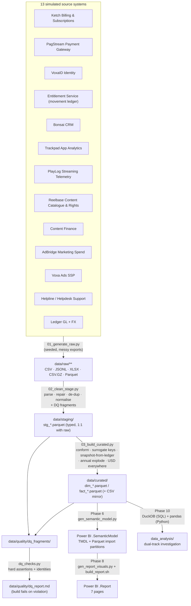

# Voxa+ — Data Architecture

**Document status:** Phase 2 deliverable.
**Depends on:** `01_business_context_kpis.md`.
**Feeds:** Phase 3 (ETL build), Phase 4 (data dictionary / model docs), Phase 6 (semantic model).

This document specifies how synthetic source data is generated, cleaned, and conformed into
a star schema. It is a build spec: every table, every layer, every data-quality issue that
Phase 3 must inject and then handle.

---

## 1. Principles — medallion, seeded, idempotent

Three layers on disk. Data only ever flows downward.

| Layer | Folder | Contract |
|---|---|---|
| **Raw** | `data/raw/<source>/` | Byte-faithful simulated exports — messy, locale-specific, duplicated, encoded however the fake source system would encode them. **Never edited after generation.** Regenerated only when `SEED` or `config.py` changes. |
| **Staging** | `data/staging/` | Exactly one typed table per raw entity: `stg_<source>_<entity>.parquet`. Parsing, type coercion, encoding repair, de-duplication, key and category normalisation. **No cross-source business logic, no metric definitions.** Every fix is counted into a DQ fragment. |
| **Curated** | `data/curated/` | Conformed Kimball star: `dim_*` / `fact_*` as Parquet **and** a CSV mirror. Surrogate keys, SCD handling, the movement-ledger-derived snapshot, annual-plan monthly recognition, content cost per view-hour, USD on every money column, `is_comparable_base`. |
| **Quality** | `data/quality/` | DQ fragments from staging + curated, assembled into `dq_report.md`; hard-assertion results from `dq_checks.py`. |

**Seeded.** A single `SEED` in `etl/config.py` drives every random draw. Same seed → byte-identical raw → identical curated.

**Idempotent.** Each script wipes and rebuilds its own layer. `run_pipeline.py` runs `01 → 02 → 03 → dq_checks` end to end; `dq_checks.py` fails the build (non-zero exit) on any violated assertion.

**Layered.** Staging may read only raw. Curated may read only staging. Nothing reads upward. The semantic model (Phase 6) reads only `data/curated/*.parquet`.

---

## 2. Tech stack & run instructions

| Concern | Choice |
|---|---|
| Language | Python 3.11+ |
| Core libs | `pandas`, `numpy`, `pyarrow` (Parquet), `python-dateutil`, `openpyxl` (write messy `.xlsx`), `Faker` (names, emails, addresses), `ftfy` + `unicodedata` (encoding repair in staging), `duckdb` (Phase 10 analysis + optional staging SQL) |
| Storage | Flat files. Raw = `.csv` / `.jsonl` / `.xlsx` / `.csv.gz` / `.parquet`. Staging & curated = `.parquet` (+ curated `.csv` mirror). No database server. |
| Orchestration | Plain scripts, run in order by `run_pipeline.py`. No Airflow / dbt. |
| Determinism | One `SEED`; all generators derive sub-seeds from it by name. |
| Windows / OneDrive | Writes go to a temp path in the same folder, then atomic `os.replace`. A retry-on-lock wrapper (`utils.write_parquet`, ~4 attempts, backoff) absorbs the intermittent WinError 5/32 locks OneDrive causes. |

```
# from repo root
python -m pip install -r etl/requirements.txt
python etl/run_pipeline.py            # full build: raw -> staging -> curated -> dq_checks
python etl/run_pipeline.py --from 02  # rebuild staging + curated only
python etl/gen_data_dictionary.py     # regenerate docs/03_data_dictionary.md from disk
```

Run order inside `run_pipeline.py`:

1. `01_generate_raw.py` — writes `data/raw/**`
2. `02_clean_stage.py` — writes `data/staging/stg_*.parquet` + `data/quality/dq_fragments/stg_*.json`
3. `03_build_curated.py` — writes `data/curated/{dim,fact}_*.{parquet,csv}` + curated DQ fragments
4. `dq_checks.py` — hard assertions; assembles `data/quality/dq_report.md`; exits non-zero on failure

---

## 3. Naming conventions

| Thing | Rule | Example |
|---|---|---|
| Raw file | `<source>__<entity>__<period-or-grain>.<ext>` | `pagstream__transactions__2024-06.csv` |
| Staging table | `stg_<source>_<entity>` | `stg_pagstream_transactions` |
| Dimension | `dim_<noun>` | `dim_subscriber` |
| Fact | `fact_<process>_<grain>` | `fact_billing_attempt` |
| Surrogate key | `<entity>_key` — integer, curated only | `subscriber_key` |
| Business key | `<entity>_id` — preserved from source | `subscriber_id` |
| Date | `<role>_date` (date) · `<role>_date_key` (int `YYYYMMDD`) | `signup_date`, `signup_date_key` |
| Timestamp | `<role>_ts_utc` (tz-aware UTC) | `event_ts_utc` |
| Money | `<measure>_local` **and** `<measure>_usd` | `mrr_local`, `mrr_usd` |
| Boolean | `is_<x>` / `has_<x>` | `is_active`, `has_downloads` |
| Columns | `snake_case` throughout curated (staging harmonises source casing) | |

Timestamps are normalised to **UTC** in staging. Curated derives a **market-local calendar day** (`America/Sao_Paulo`, `America/Mexico_City`, `America/New_York`) and the `*_date_key` from that local day, so month-boundary events land in the right reporting month per market.

---

## 4. Source-system inventory

Thirteen simulated systems. "Export style" is what makes each one messy.

| # | System (fictional) | Owns | Raw entities | Export style / quirks |
|---|---|---|---|---|
| 1 | **Ketch Billing & Subscriptions** | Subscriptions, invoices, plan catalogue | `subscriptions_snapshot`, `invoices`, `plan_catalog` | Daily **full-dump** snapshot CSV (same rows re-exported every day → dupes); `invoices` split into monthly files with **overlapping date ranges**; `plan_catalog.xlsx` with **Excel serial** effective dates and price as text `"R$ 29,90"`. |
| 2 | **PagStream Payment Gateway** | Billing attempts, auth/capture/refund, settlement | `transactions`, `settlement` | One row per attempt; a semi-structured `meta` JSON blob column; `amount` is **gross for approved rows but net-of-fee for settled rows** (mislabelled); refunds as **negative amounts** in some months, `type='refund'` positive rows in others; timestamps in UTC with `Z`. |
| 3 | **VoxaID Identity** | Accounts, email, market, device registrations, consent | `accounts`, `device_registrations` | `accounts.csv` UTF-8 **with BOM**; `market` as free text (`BR`/`Brasil`/`Brazil`); GDPR-deleted accounts **absent** though still referenced downstream; test accounts not flagged. |
| 4 | **Entitlement Service** | Subscription lifecycle **movement ledger** | `entitlement_events` | Newline-delimited JSON (`.jsonl`); event types `trial_start`, `trial_convert`, `paid_start`, `plan_change`, `pause`, `resume`, `cancel_request`, `churn`, `reactivate`; **at-least-once delivery** → duplicate `event_id`s; the source of truth the curated snapshot is rebuilt from. |
| 5 | **Bonsai CRM** | Customer attributes, lifecycle stage, win-back campaign membership | `crm_contacts`, `winback_membership` | Latin-1 encoded names/titles → **mojibake** when read as UTF-8; lifecycle stage free text; `birth_year` occasionally `0` or `1900`; joined late so early cohorts have blank CRM rows. |
| 6 | **Trackpad App Analytics** | App sessions, screens, crashes, app version, device | `app_events` (daily) | `app_events__YYYY-MM-DD.csv.gz`, **event-sampled** (~ not every session), at-least-once → duplicate `event_id`; `device_family` values unnormalised (`SmartTV`/`Smart TV`/`CTV`); `app_version` string; **UTC** timestamps. |
| 7 | **PlayLog Streaming Telemetry** | Play starts, watch time, bitrate, playback errors, rebuffering, CDN bytes | `playlog` (daily) | `playlog__YYYY-MM-DD.parquet`; watch time in **seconds before ~month 20, milliseconds after** an SDK update (unit break); CDN bytes in **MB from one edge provider, GB from another**; a batch of **negative `watch_seconds`** from clock skew; `content_id`s that don't exist in Reelbase. |
| 8 | **Reelbase Content Catalogue & Rights** | Titles, genre, language, originals flag, licence windows | `titles`, `licence_windows` | `reelbase_titles.xlsx`, multiple sheets; accented PT/ES titles with **encoding damage**; `release_date` mixes `DD/MM/YYYY` and Excel serials; some titles missing a genre; `is_original` as `"Y"/"N"/""/1/0`. |
| 9 | **Content Finance** | Amortisation schedules, minimum guarantees, cash milestones | `amort_schedule`, `cash_milestones` | `.xlsx`, one sheet per content vintage; amounts as text with parentheses negatives `"(120.000,00)"`; month columns as **Excel serials**; MG in local currency, no currency column (implied by sheet name). |
| 10 | **AdBridge Marketing Spend** | Spend, impressions, clicks, attributed sign-ups by channel/campaign | `spend_weekly`, `attribution` | `spend_weekly.csv`; **channel names not normalised** (`Paid Social`/`paid_social`/`FB/IG`/`Meta`); for the Mexico platform the `spend_usd` header actually holds **MXN**; one **column mislabelled** — `clicks` holds impressions for a partner-network row; a test campaign with `spend=0`, 10k sign-ups. |
| 11 | **Voxa Ads SSP** | Ad impressions served vs Básico viewing, fill rate, eCPM, ad revenue | `ssp_daily_revenue` | `ssp_daily_revenue.csv`; `date` as `MM/DD/YYYY` (US-formatted export); revenue in USD; occasional duplicated day rows from re-runs. |
| 12 | **Helpline → Helpdesk Support** | Support tickets, reason, resolution time, CSAT | `helpline_v1_tickets` (≤ month 13), `helpdesk_v2_tickets` (≥ month 13) | **Schema break at the mid-window migration** (event §8, doc 01): different column names, different reason taxonomy, different id format; ~some tickets **duplicated across the cutover**; CSAT 1–5 in v1, 0–10 in v2. |
| 13 | **Ledger (Finance GL) + FX** | Monthly P&L actuals by line, allocations, FX rates | `gl_trial_balance` (monthly), `fx_rates` | `gl_trial_balance__YYYY-MM.csv`; account names free text; `fx_rates.csv` monthly **average and end-of-period** rates for BRL/USD and MXN/USD, a few months missing (forward-fill in staging). |

Two of these correspond to **neutral history events** in doc 01 §8: the support migration (#12) and, indirectly, the marketing-mix shift (#10). Neither is asserted to be a cause of anything.

---

## 5. Raw layer — what `01_generate_raw.py` emits

Grouped by simulated system. Volumes are approximate at `SEED` default (balanced scale).

| Raw file(s) | Grain | ~Rows | Key messy traits injected |
|---|---|---|---|
| `ketch__subscriptions_snapshot__YYYY-MM-DD.csv` (daily) | account × snapshot day | ~9M total (dupe-heavy) | full re-dump daily; **drifts from the ledger**; plan name casing noise; `country` free text |
| `ketch__invoices__YYYY-MM.csv` | invoice line | ~1.6M | overlapping monthly ranges → cross-file dupes; money as `"R$ 1.234,56"`; annual plans as a single line |
| `ketch__plan_catalog.xlsx` | plan × market × effective period | ~60 | Excel-serial dates; price as text; retired plans with null successor |
| `pagstream__transactions__YYYY-MM.csv` | billing attempt | ~2.1M | `meta` JSON blob; `amount` gross-vs-net mislabel; negative refunds; attempt_number, dunning flags |
| `pagstream__settlement__YYYY-MM.csv` | settlement batch line | ~40k | settlement lag; fee columns; carrier-billing batches lag one month |
| `voxaid__accounts.csv` | account | ~120k | UTF-8 BOM; free-text market; GDPR-deleted omitted; unflagged test accounts |
| `voxaid__device_registrations.csv` | account × device | ~260k | unnormalised `device_family`; duplicate registrations |
| `entitlement__events.jsonl` | lifecycle event | ~950k | duplicate `event_id`; out-of-order timestamps; the movement source of truth |
| `bonsai__crm_contacts.csv` | account | ~110k | Latin-1 mojibake; free-text lifecycle stage; `birth_year` 0/1900; missing early cohorts |
| `bonsai__winback_membership.csv` | account × campaign | ~70k | campaign name noise; overlapping memberships |
| `trackpad__app_events__YYYY-MM-DD.csv.gz` (daily) | app event (sampled) | ~11M | duplicate `event_id`; device/version noise; UTC; crash events interleaved |
| `playlog__YYYY-MM-DD.parquet` (daily) | play/watch beacon | ~14M | seconds→ms unit break ~month 20; MB/GB byte-unit split; negative `watch_seconds` batch; orphan `content_id` |
| `reelbase__titles.xlsx` | title | ~3.5k | encoding damage; mixed date formats; missing genre; `is_original` mixed types |
| `reelbase__licence_windows.csv` | title × market × window | ~9k | licence start/end; some windows expiring mid-window (§8 event) |
| `contentfin__amort_schedule.xlsx` | title × month | ~40k | parentheses negatives; Excel-serial month columns; implied currency |
| `contentfin__cash_milestones.xlsx` | title × milestone | ~1.2k | lumpy cash dates; MG local currency |
| `adbridge__spend_weekly.csv` | week × market × channel × campaign | ~30k | channel-name noise; MXN-in-USD-column; `clicks`/impressions mislabel; zero-spend test campaign |
| `adbridge__attribution.csv` | sign-up × touch | ~140k | last-touch only; some sign-ups unattributed (→ "unknown" channel) |
| `voxaads__ssp_daily_revenue.csv` | market × day | ~3.2k | `MM/DD/YYYY` dates; duplicate day rows |
| `helpline__v1_tickets.csv` | ticket (≤ m13) | ~55k | v1 schema; CSAT 1–5 |
| `helpdesk__v2_tickets.csv` | ticket (≥ m13) | ~120k | v2 schema; CSAT 0–10; cutover dupes |
| `ledger__gl_trial_balance__YYYY-MM.csv` | month × GL account | ~4k | free-text account names; allocation lines |
| `ledger__fx_rates.csv` | month × currency pair | ~150 | avg + eop rate; a few months missing |

---

## 6. Staging layer — `02_clean_stage.py`

One `stg_*` table per raw entity above. Staging responsibilities, and the DQ counter each raises:

| Fix class | What happens | DQ counter(s) |
|---|---|---|
| **Date parsing** | Detect and parse `YYYY-MM-DD`, `DD/MM/YYYY`, `MM/DD/YYYY`, `DD-MON-YY`, ISO-8601 with TZ, and **Excel serials** (epoch 1899-12-30). Ambiguous `01/02/2025` resolved by source locale rule. | `dates_parsed`, `excel_serials_converted`, `dates_unparseable` |
| **Money parsing** | Strip currency symbols and thousands separators by locale; `"(x)"` → `-x`; `"R$ 1.234,56"` → `1234.56`; blank → null (never 0). | `money_strings_parsed`, `money_negatives_from_parens` |
| **Encoding repair** | `ftfy.fix_text` + targeted Latin-1→UTF-8 re-decode for Reelbase / CRM; strip BOM. | `mojibake_repaired`, `bom_stripped` |
| **De-duplication** | Drop exact-duplicate `event_id` (entitlement, app, SSP); collapse daily full-dump snapshots to one row per account per day; dedupe overlapping invoice files on `invoice_id`. | `dupe_events_dropped`, `dupe_invoice_lines_dropped`, `snapshot_rows_collapsed` |
| **Unit normalisation** | PlayLog watch time → **seconds** (detect ms era by magnitude + date); CDN bytes → **GB**; CSAT → **0–1 score** (v1 `/5`, v2 `/10`). | `watchtime_unit_fixed`, `bytes_unit_fixed`, `csat_rescaled` |
| **Category harmonisation** | Map channel, plan-name, device-family, market free text to controlled vocabularies (lookup tables in `etl/vocab/`). Unknowns → explicit `"unknown"` + logged. | `categories_normalised`, `category_unknowns` |
| **Mislabelled columns** | AdBridge: move partner-network `clicks`→`impressions`; convert MX platform `spend_usd`→`spend_local` (MXN) and recompute USD. PagStream: reconstruct **gross** `amount` for settled rows from fee columns. | `mislabeled_columns_corrected` |
| **Key normalisation** | Trim/upper business keys; cast to string; null-out placeholder keys (`"0"`, `""`, `"N/A"`). | `null_keys_flagged` |
| **Schema unification** | Map Helpline v1 + Helpdesk v2 to one `stg_support_tickets` schema and one reason taxonomy (crosswalk in `etl/vocab/support_reason_crosswalk.csv`); tag `source_version`. | `support_rows_v1`, `support_rows_v2`, `cutover_dupes_dropped` |
| **Type coercion** | Enforce a declared dtype per column; coercion failures → null + counter. | `type_coercion_failures` |
| **Timezone** | All timestamps → tz-aware UTC. | `timestamps_localized` |

Staging does **not** join across sources (except attaching a normalised key), does **not** compute MRR / churn / margin, and does **not** drop rows for referential problems — that is curated's job, with a full accounting.

---

## 7. Curated layer — `03_build_curated.py`

Kimball star. `dim_date` is built first and spans **2023-01-01 → 2027-12-31** (well beyond the fact window, per the guardrail about a stray "(blank)" member when cash / renewals settle past the end).

### 7.1 Dimensions

| Table | Grain | Notable attributes |
|---|---|---|
| `dim_date` | calendar day | `date_key`, y/q/m/w, month-name, `is_month_end`, fiscal cols, `is_holiday_br/mx/us`, `season_tag`, hidden sort keys |
| `dim_market` | market | `market_id` (BR/MX/US), `currency_code`, `market_active_from_date`, timezone |
| `dim_subscriber` | account | `subscriber_key`, `subscriber_id`, `market_key`, `signup_date_key`, `cohort_month`, `acquisition_channel_key`, `acquisition_campaign_key`, `first_plan_key`, `current_plan_key`, `is_annual_ever`, `age_band`, `is_comparable_base` (market = BR), `is_l4l_cohort` (cohort_month ≤ 2025-08), `is_test_account` (recovered flag), `crm_lifecycle_stage` |
| `dim_plan` | plan × market | `plan_key`, `tier` (Básico/Standard/Premium), `billing_period` (monthly/annual), `has_ads`, `max_streams`, `max_resolution`, `has_downloads` |
| `dim_price_history` | plan × market × effective period | `list_price_local`, `list_price_usd`, `effective_from_date_key`, `effective_to_date_key` — the price-change events live here |
| `dim_channel` | acquisition channel | `channel` (direct / paid_search / paid_social / affiliate / partner_bundle / organic / unknown), `channel_group`, `is_incentivised_default` |
| `dim_campaign` | marketing campaign | `campaign_key`, `channel_key`, `market_key`, `start/end`, `objective` |
| `dim_payment_method` | method | `method` (card / pix / boleto / oxxo / carrier_billing), `is_prepaid`, `settlement_lag_days_typical` |
| `dim_content` | title | `content_key`, `title` (repaired), `content_type`, `primary_genre`, `language`, `is_original`, `release_date_key`, `runtime_min` |
| `dim_content_release` | title × market | `release_date_key`, `is_tentpole`, `had_marketing_push` |
| `dim_device` | device family | `device_family` (mobile_ios / mobile_android / web / smart_tv / streaming_stick / console), `device_class` (mobile / web / ctv) |
| `dim_support_reason` | reason | unified taxonomy: `reason_category`, `reason_group` (billing / app_tech / content / account / other) |
| `dim_app_version` | app version | `app_version`, `release_date_key`, `device_class`, `is_major` |
| `dim_reporting_currency` *(disconnected — built in Phase 6)* | currency | drives the currency slicer |

### 7.2 Facts

| Table | Grain | Measures / columns | Build notes |
|---|---|---|---|
| `fact_subscription_event` | one lifecycle event | `event_type`, `event_ts_utc`, `event_date_key`, `from_plan_key`, `to_plan_key`, `reason_code` | Deduped, ordered movement ledger. **The source of truth.** |
| `fact_subscription_month` | subscriber × month | `is_active_eom`, `status` (active/paused/churned), `plan_key`, `tenure_months`, `mrr_local`, `mrr_usd`, `is_new`, `is_reactivation`, `is_voluntary_churn`, `is_involuntary_churn`, `is_paused` | **Derived from `fact_subscription_event`**, not from the Ketch snapshot. Snapshot-vs-ledger drift is measured and written to the DQ report. Annual plans recognised at `list_price / 12` per active month. |
| `fact_billing_attempt` | one billing attempt | `amount_local/usd`, `fee_local/usd`, `net_local/usd`, `method_key`, `status` (approved/failed/refunded/chargeback), `failure_reason`, `attempt_number`, `is_dunning`, `is_recovered`, `days_to_recovery` | Refund/chargeback signs normalised; fee reconstructed; linked to subscription + method. |
| `fact_viewing_daily` | subscriber × local date | `streamed_minutes`, `play_starts`, `distinct_titles`, `primary_device_family_key`, `playback_errors`, `video_start_failures`, `rebuffer_ratio`, `bitrate_tier`, `cdn_gb` | Aggregated from `stg_playlog`; watch time in seconds→minutes; orphan `content_id` rows kept with `content_key = -1` (unknown) and counted. **Subscriber-level QoE preserved** so engagement/quality can be tied to individual churn. |
| `fact_viewing_title_month` | subscriber × title × month | `streamed_minutes`, `completed` | Slim rollup for content-level engagement cuts (kept small by monthly grain). |
| `fact_app_performance_daily` | market × date × device_family × app_version | `sessions`, `crashes`, `crash_free_rate`, `anr_count` | Aggregated app-health fact for the CX page; subscriber-level crash counts also folded into `fact_viewing_daily`. |
| `fact_engagement_month` | subscriber × month | `active_days`, `streamed_hours`, `distinct_titles`, `pct_days_ctv`, `below_healthy_engagement` (bool, < 5h), `engagement_decile` | Curated rollup — the leading-indicator table for cohort/retention analysis. |
| `fact_marketing_spend` | week × market × channel × campaign | `spend_local/usd`, `impressions`, `clicks`, `signups_attributed` | Post-normalisation of AdBridge; test campaign quarantined with `is_excluded = true`. |
| `fact_ad_revenue` | market × date | `impressions_served`, `fill_rate`, `ecpm_usd`, `ad_revenue_usd` | From SSP; joined to Básico viewing for sanity. |
| `fact_content_cost` | title × month | `amort_usd`, `cash_spend_usd`, `mg_local/usd` | Parentheses negatives fixed; Excel-serial months resolved; **content cost per view-hour** derived by joining to `fact_viewing_title_month`. |
| `fact_support_ticket` | one ticket | `created_date_key`, `contact_channel`, `reason_category_key`, `resolution_hours`, `csat_score` (0–1), `is_reopened`, `source_version` | Unified v1/v2; cutover dupes removed. |
| `fact_fx_rate` | month × currency pair | `avg_rate`, `eop_rate` | Missing months forward-filled in staging; `= 1` for USD/USD. |
| `fact_finance_month` | month × market × pnl_line | `amount_local/usd` | From GL; conformed to the P&L line list; ties to the operational facts within tolerance (a DQ check). |
| `fact_targets_month` | month × market × kpi | `target_value` | Plan from doc 01 §14; built local then FX-converted. |

### 7.3 Cross-cutting curated rules

- **Snapshot from ledger.** `fact_subscription_month` is folded forward from `fact_subscription_event`. The Ketch snapshot is used **only** to measure drift (rows where snapshot status ≠ ledger-derived status), reported as a DQ metric, never as input.
- **Annual-plan explode.** One annual invoice → 12 monthly MRR recognitions; cash vs recognition tracked separately.
- **Content cost per view-hour** = title-month `amort_usd` ÷ title-month streamed hours (moving denominator), with a floor to avoid divide-by-near-zero on unreleased titles — the SVOD analogue of moving-average COGS.
- **USD everywhere.** Every `_local` money column gets a `_usd` sibling at the month's `avg_rate`.
- **Referential integrity.** Facts referencing a missing dimension key get a sentinel key (`-1` unknown / `-2` late-provisioned) and a counted DQ row; they are **not** dropped.
- **`is_comparable_base`** stamped on `dim_subscriber` and propagated to facts via the subscriber key.
- **Local calendar day** per market drives every `*_date_key` on event-grain facts.

---

## 8. Data-quality issue catalogue (the injection list)

Every item is injected by `01_generate_raw.py`, handled by `02`/`03`, counted into a DQ fragment, and (where it is an invariant) asserted in `dq_checks.py`.

| # | Issue | Injected in | Handled in | Hard check |
|---|---|---|---|---|
| Q01 | Multiple date formats + Excel serials | plan_catalog, reelbase, contentfin, ssp | staging date parser | `dates_unparseable = 0` |
| Q02 | Money as locale strings, parentheses negatives, symbol-in-value | invoices, contentfin, adbridge | staging money parser | no non-null money column is of object dtype |
| Q03 | Encoding damage (Latin-1 mojibake, BOM) | reelbase, bonsai, voxaid | `ftfy` + re-decode | no `Ã` / `Â` sequences remain in `dim_content.title` |
| Q04 | Duplicate rows — event at-least-once, overlapping invoice files, daily full-dump snapshot | entitlement, trackpad, ssp, ketch | staging de-dup | `fact_subscription_event` unique on `event_id`; invoices unique on `invoice_id` |
| Q05 | Master rows missing — orphan subscriber_id / content_id (GDPR-deleted, late-provisioned, unlisted titles) | voxaid omissions, playlog | curated sentinel keys + count | every fact FK resolves (to a real or sentinel key) |
| Q06 | Mislabelled column — `clicks` holds impressions; `spend_usd` holds MXN; `amount` gross-vs-net | adbridge, pagstream | staging column correction | marketing `clicks ≤ impressions` for all rows |
| Q07 | Snapshot-vs-ledger drift | ketch snapshot vs entitlement ledger | curated builds snapshot from ledger; drift measured | drift rows reported; curated status = ledger status by construction |
| Q08 | Sign / negative errors — negative refunds, negative watch_seconds, negative days_to_recovery | pagstream, playlog | staging sign normalisation | `fact_viewing_daily.streamed_minutes ≥ 0`; refunds stored with consistent sign |
| Q09 | Unit inconsistency — watch seconds→ms, CDN MB vs GB, CSAT /5 vs /10 | playlog SDK era, edge providers, support migration | staging unit normalisation | watch minutes per sub-day ≤ 1440; `csat_score` ∈ [0,1] |
| Q10 | Categorical noise — channel / plan / market / device free text | adbridge, ketch, voxaid, trackpad | staging vocab mapping | all `dim_*` category columns ∈ controlled vocab |
| Q11 | Schema break — Helpline v1 → Helpdesk v2 | support source | staging schema unification + crosswalk | `fact_support_ticket` single schema; taxonomy ∈ `dim_support_reason` |
| Q12 | Late / partial / restating files — partner settlement lag, incomplete final month | pagstream settlement, partner recon | staging forward-fill + `is_partial_period` flag on `dim_date` | last-month completeness flagged, not silently averaged |
| Q13 | Null keys — guest billing rows, retired plan_id | pagstream, ketch | staging null-flag; curated sentinel | null-key count reported; no null surrogate keys in facts |
| Q14 | Outliers — 30h+/day viewing, US$0/10k-signup test campaign, annual invoice as one line | playlog, adbridge, invoices | curated caps / quarantine / annual explode | `fact_marketing_spend` excludes quarantined campaign from KPIs |
| Q15 | Timezone / month-boundary bleed | UTC events vs local billing | curated local-day derivation | monthly viewing totals reconcile to daily within tolerance |

`dq_checks.py` also asserts the **accounting / roll-up identities**: subscription-month base rolls forward (`start + new + reactivation − churn = end`), MRR ties to Σ(active × price/12) within tolerance, `fact_finance_month` subscription revenue ≈ curated MRR within tolerance, cohort retention ≤ 100% and monotonic non-increasing, and every KPI in doc 01 §13 lands inside its stated benchmark band for the **pre-shift** baseline (the shift months are allowed to break the band — that is the point).

---

## 9. Architecture diagram



---

## 10. Open items carried into Phase 3

| # | Item | Resolution plan |
|---|---|---|
| B1 | Exact churn-shift mechanism (the 2–3 contributing factors) | **Decided in Phase 3**, encoded in `config.py` as tunable effect sizes; kept out of doc 01. |
| B2 | Final row volumes vs the ~10–15M viewing target | Calibrate `SEED`-default population and sampling in the first regeneration pass. |
| B3 | Benchmark-band calibration (AOV/ARPU, margin, churn, CAC, retention, delivery, on-time) | Several regeneration passes until the pre-shift baseline sits mid-band for every doc 01 §13 KPI. |
| B4 | Holiday/season calendars for BR/MX/US | Static lookup in `etl/vocab/holidays.csv`. |
| B5 | FX path shape | Seeded random walk with drift, clamped to the doc 01 §10 ranges; no single-month shock. |

---

*End of Phase 2 deliverable.*
